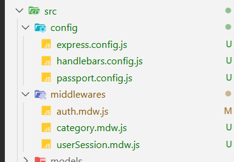
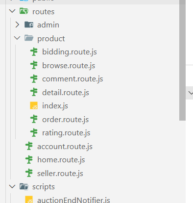
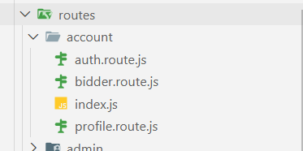
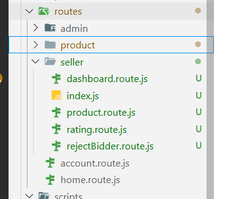
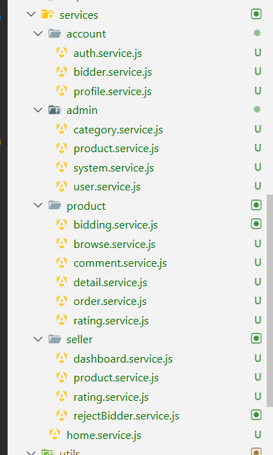

# Báo cáo Refactoring dự án Online Auction

<style>
  div p {
    text-align: justify;
    text-justify: inter-word;
  }
  
  mark {
    background: none !important;
    font-family: monospace;
    color: #c0341d;
    font-weight: bold;
  }
  
  .markdown-body code{
    color: #c0341d !important;
  }
  
  div>code, h6>code, p>code, li>code, td>code {
    background-color: #fbe5e1 !important;
    font-weight: bold;
  }
</style>

:::info
**Mục đích:** Xác định những vi phạm nguyên lý `SOLID`, `KISS`, `DRY`, `YAGNI`. Đánh giá tác động và xác định hướng giải quyết.
**Tác giả:** Ngô Trần Quang Đạt
:::

## SINGLE RESPONSIBILITY PRINCIPLE
### 📌 1. `src/index.js`

**Mô tả vi phạm:**

File `index.js` vi phạm SRP nghiêm trọng khi đảm nhận **quá nhiều trách nhiệm**:

1.  **Cấu hình Express** (middleware, session, static files)
```javascript
app.use('/static', express.static('public'));
app.use(express.urlencoded({ extended: true, limit: '50mb' }));
app.use(express.json({ limit: '50mb' }));
app.use(methodOverride('_method'));
app.use(session({
  secret: 'x8w3v9p2q1r7s6t5u4z0a8b7c6d5e4f3g2h1j9k8l7m6n5o4p3q2r1s0t9u8v7w6x5y4z3',
  resave: false,
  saveUninitialized: true,
  cookie: { secure: false } // false chạy localhost
}));

// Initialize Passport
app.use(passport.initialize());
app.use(passport.session());

```
2.  **Cấu hình View Engine** (Handlebars với 30+ helper functions)
```javascript
app.set('view engine', 'handlebars');
app.set('views', './views');;

```
3.  **Quản lý Authentication state** (middleware kiểm tra user session)
```javascript
app.use(async function (req, res, next) {
  if (typeof req.session.isAuthenticated === 'undefined') {
    req.session.isAuthenticated = false;
  }
  
  // Nếu user đã đăng nhập, kiểm tra xem thông tin có thay đổi không
  if (req.session.isAuthenticated && req.session.authUser) {
    const currentUser = await userModel.findById(req.session.authUser.id);
    ...
});

```
4.  **Quản lý Category data** (middleware load categories)
```javascript
app.use(async function (req, res, next) {
  const plist = await categoryModel.findLevel1Categories();
  const clist = await categoryModel.findLevel2Categories();
  res.locals.lcCategories1 = plist;
  res.locals.lcCategories2 = clist;
  next();
});


```
6.  **Route registration** (đăng ký tất cả routes)

```javascript
// Các Route Admin
app.use('/admin/account', adminAccountRouter);
app.use('/admin/users', adminUserRouter);
app.use('/admin/categories', adminCategoryRouter);
app.use('/admin/products', adminProductRouter);
app.use('/admin/system', adminSystemRouter);
// Các Route Seller
app.use('/seller', isAuthenticated, isSeller, sellerRouter);
...
// Các Route Client (Đặt cuối cùng để tránh override)
app.use('/', homeRouter);
app.use('/products', productRouter);
app.use('/account', accountRouter);
```
6.  **Authorization logic** (isAdmin middleware)
```javascript
// A. Bảo mật trước tiên: Mọi route /admin/* phải qua cửa kiểm soát

app.use('/admin', isAdmin);

// B. Thiết lập giao diện Admin (Bật cờ để Layout biết đường hiển thị Sidebar)
app.use('/admin', function (req, res, next) {
    res.locals.isAdminMode = true; 
    next();
});
```
7.  **File upload configuration** (multer setup)
```javascript
// Tạo thư mục uploads nếu chưa có
const uploadDir = path.join(__dirname, 'public', 'images', 'products');
if (!fs.existsSync(uploadDir)) {
  fs.mkdirSync(uploadDir, { recursive: true });
}

// File filter (chỉ cho phép ảnh)
const fileFilter = (req, file, cb) => {
  const allowedTypes = /jpeg|jpg|png|webp/;
  const extname = allowedTypes.test(path.extname(file.originalname).toLowerCase());
  const mimetype = allowedTypes.test(file.mimetype);

  if (mimetype && extname) {
    return cb(null, true);
  } else {
    cb(new Error('Only image files (jpeg, jpg, png, webp) are allowed!'));
  }
};
```
8.  **API endpoints** (GET /api/categories)
```javascript
app.get("/api/categories", async (req, res) => {
    try {
        const categories = await categoryModel.findAll();
        // Add level information based on parent_id
        const categoriesWithLevel = categories.map((cat) => ({
            ...cat,
            level: cat.parent_id ? 2 : 1,
        }));
        res.json({ categories: categoriesWithLevel });
    } catch (error) {
        console.error("Error fetching categories:", error);
        res.status(500).json({ error: "Failed to load categories" });
    }
});
```

9.  **Server startup** (port binding)
```javascript
app.listen(PORT, function () {
    console.log(`Server is running on http://localhost:${PORT}`);

    // Start scheduled jobs
    startAuctionEndNotifier(30); // Check every 30 seconds for ended auctions
});
```
10. **Job scheduling** (auction end notifier)


:::danger
**Tác động tiêu cực:**

* **Khó bảo trì:** File 408 dòng, quá dài và phức tạp.
* **Khó test:** Không thể test riêng từng phần logic.
* **Khó mở rộng:** Thêm helper/middleware mới làm file càng phình to.
* **Vi phạm Separation of Concerns:** Trộn lẫn configuration, business logic, và routing.
:::

### 💡 Đề xuất cải thiện

Tách thành các module riêng biệt:

1. **Cấu hình Express:** `src/config/express.config.js`
2. **Cấu hình Handlebars:** `src/config/handlebars.config.js`
3. **Cấu hình Passport:** `src/config/passport.config.js`
4. **Middlewares:** `src/middlewares/*.mdw.js`
5. **Routes:** Dời API endpoints qua `src/routes/api.route.js`, logic qua `src/services/category.service.js`
### Minh chứng
Cấu trúc thư mục


File ***index.js*** sau khi refactoring:
```javascript
// PHẦN IMPORT
import ...
...

// 1. CẤU HÌNH CỐT LÕI
configureExpress(app);
configurePassport(app);

// 2. CẤU HÌNH VIEW ENGINE (Handlebars)
configureHandlebars(app);

// 3. MIDDLEWARE TOÀN CỤC
app.use(userSessionMiddleware);
app.use(categoryMiddleware);

// 4. CẤU HÌNH LOGIC ADMIN
app.use('/admin', isAdmin, setAdminMode);

// 5. ROUTES
app.use('/api', apiRouter);      
app.use('/admin', adminRouter);
app.use('/seller', isAuthenticated, isSeller, sellerRouter);
app.use('/', homeRouter);
app.use('/products', productRouter);
app.use('/account', accountRouter);
```

**`src/services/category.service.js` — logic tách riêng:**
```javascript
export async function getCategoriesWithLevel() {
  const categories = await categoryModel.findAll();
  return categories.map(cat => ({ ...cat, level: cat.parent_id ? 2 : 1 }));
}
```

**`src/routes/api.route.js` — route tách riêng:**
```javascript
router.get('/categories', async (req, res) => {
  const categories = await getCategoriesWithLevel(); // ✅ gọi service, không inline logic
  res.json({ categories });
});
```

---

### 📌 2. `src/routes/product.route.js`

**Mô tả vi phạm:**
`product.route.js` là một **God File** điển hình với đến **1860 dòng**, đảm nhận mọi trách nhiệm liên quan đến sản phẩm:

1. **Duyệt sản phẩm** — lọc theo category, tìm kiếm, hiển thị danh sách
```javascript
router.get('/category', async (req, res) => {
  const userId = req.session.authUser ? req.session.authUser.id : null;
  const sort = req.query.sort || '';
  ...
});

router.get('/search', async (req, res) => {
  const userId = req.session.authUser ? req.session.authUser.id : null;
  const q = req.query.q || '';
    ...
});
```
2. **Chi tiết sản phẩm** — lấy thông tin, ảnh, comments, bidding history
```javascript
router.get('/detail', async (req, res) => {
  const userId = req.session.authUser ? req.session.authUser.id : null;
  const productId = req.query.id;
  ...
});
router.post('/comment', isAuthenticated, async (req, res) => {
  const { productId, content, parentId } = req.body;
  const userId = req.session.authUser.id;
  ...
});
router.get('/bidding-history', isAuthenticated, async (req, res) => {
  const productId = req.query.id;
  
  if (!productId) {
    return res.redirect('/');
  }
  ...
  
});

```
3. **Đặt giá / Mua ngay** — xử lý toàn bộ luồng bid (450 dòng trong một handler duy nhất)
```javascript
// ROUTE 3: ĐẶT GIÁ (POST) - Server-side rendering with automatic bidding
router.post('/bid', isAuthenticated, async (req, res) => {
  ...

});
```

```javascript
// ROUTE: BUY NOW (POST) - Bidder directly purchases product at buy now price
router.post('/buy-now', isAuthenticated, async (req, res) => {
  ...
});
```
4. **Quản lý đơn hàng** — xác nhận thanh toán, vận chuyển, giao hàng
```javascript
// ROUTE: COMPLETE ORDER PAGE (For PENDING products)
router.get('/complete-order', isAuthenticated, async (req, res) => {
  ...
});
```
```javascript
router.post('/order/:orderId/confirm-payment', isAuthenticated, async (req, res) => {
	...
})
```

```javascript
router.post('/order/:orderId/submit-shipping', isAuthenticated, async (req, res) => {
	...
})
```

```javascript
router.post('/order/:orderId/confirm-delivery', isAuthenticated, async (req, res) => {
	...
})
```
5. **Hóa đơn** — tải lên và xử lý payment/shipping invoices
```javascript
router.post('/order/:orderId/submit-payment', isAuthenticated, async (req, res) => {
  ...
});
```
6. **Đánh giá** — buyer đánh giá seller và ngược lại sau giao dịch

```javascript
router.get('/seller/:sellerId/ratings', async (req, res) => {
  ...
});

router.get('/bidder/:bidderId/ratings', async (req, res) => {
  ...
});
```

7. **Comment** — thêm, lấy, phân trang comment
```javascript
router.post('/comment', isAuthenticated, async (req, res) => {
  ...
});
```

8. **Reject bidder** — seller chặn bidder cụ thể
```javascript
router.post('/reject-bidder', isAuthenticated, async (req, res) => {
  ...
});

router.post('/unreject-bidder', isAuthenticated, async (req, res) => {
  ...
});
...
```

:::danger
**Tác động tiêu cực:**

* **Không thể phân công công việc:** Mọi thay đổi liên quan đến sản phẩm đều phải đụng vào cùng 1 file.
* **Merge conflict thường xuyên** khi nhiều người làm việc song song.
* **1860 dòng** — không thể nắm bắt toàn bộ file trong đầu khi đọc code.
:::

**💡 Đề xuất cải thiện:**
Tách thành các route nhỏ theo bounded context:

```
src/routes/
  product/
    browse.route.js     — danh sách, tìm kiếm, category
    detail.route.js     — chi tiết sản phẩm
    bidding.route.js    — đặt giá, mua ngay
    order.route.js      — quản lý đơn hàng, hóa đơn
    comment.route.js    — bình luận
    index.js            — route chính, chỉ định prefix và đăng ký các sub-route
```
### Minh chứng
Cấu trúc thư mục

---

### 📌 3. `src/routes/account.route.js`

**Mô tả vi phạm:**
`account.route.js` gộp chung các nhóm chức năng hoàn toàn độc lập:

1. **Authentication** — signin, signup, verify email, forgot/reset password, OAuth, OTP


```javascript
// Đăng ký, Đăng nhập & Đăng xuất
router.get('/signup', function (req, res) { ... });
router.post('/signup', async function (req, res) { ... });
router.get('/signin', function (req, res) { ... });
router.post('/signin', async function (req, res) { ... });
router.post('/logout', isAuthenticated, (req, res) => { ... });

// Xác thực Email & OTP
router.get('/verify-email', (req, res) => { ... });
router.post('/verify-email', async (req, res) => { ... });
router.post('/resend-otp', async (req, res) => { ... });

// Quên & Đặt lại mật khẩu
router.get('/forgot-password', (req, res) => { ... });
router.post('/forgot-password', async (req, res) => { ... });
router.post('/verify-forgot-password-otp', async (req, res) => { ... });
router.post('/resend-forgot-password-otp', async (req, res) => { ... });
router.post('/reset-password', async (req, res) => { ... });

// OAuth (Google, Facebook, Github)
router.get('/auth/google', passport.authenticate(...) ...);
router.get('/auth/google/callback', ...);
router.get('/auth/facebook', ...);
router.get('/auth/facebook/callback', ...);
router.get('/auth/github', ...);
router.get('/auth/github/callback', ...);
```

2. **Profile** — xem và cập nhật thông tin cá nhân
```javascript
router.get('/profile', isAuthenticated, async (req, res) => { ... });
router.put('/profile', isAuthenticated, async (req, res) => { ... });
```
3. **Watchlist** — xem danh sách sản phẩm yêu thích
```javascript
router.get('/watchlist', isAuthenticated ,async (req, res) => { ... });
```
4. **Bidding history** — xem các sản phẩm đang đấu giá
```javascript
router.get('/bidding', isAuthenticated, async (req, res) => { ... });
```
5. **Won auctions** — xem các phiên đấu giá đã thắng
```javascript
router.get('/auctions', isAuthenticated, async (req, res) => { ... });
router.post('/won-auctions/:productId/rate-seller', isAuthenticated, async (req, res) => { ... });
router.put('/won-auctions/:productId/rate-seller', isAuthenticated, async (req, res) => { ... });
```
6. **Ratings** — xem đánh giá nhận được

```javascript
router.get('/ratings', isAuthenticated, async (req, res) => { ... });
```
7. **Upgrade request** — gửi yêu cầu nâng cấp lên seller

```javascript
router.get('/request-upgrade', isAuthenticated, async (req, res) => { ... });
router.post('/request-upgrade', isAuthenticated, async (req, res) => { ... });
```
:::warning
**Tác động:**

* File 725 dòng phình to theo tất cả các tính năng liên quan đến user.
* Logic xác thực (OTP, bcrypt, reCAPTCHA) lẫn lộn với logic hiển thị profile.
:::

**💡 Đề xuất cải thiện:**

```
src/routes/
  auth.route.js       — signin, signup, OTP, OAuth, forgot/reset password
  profile.route.js    — xem & cập nhật thông tin cá nhân
  bidder.route.js     — watchlist, bidding history, won auctions, ratings
  index.js                — route chính, chỉ định prefix và đăng ký các sub-route
```
### Minh chứng
Cấu trúc thư mục

---

### 📌 4. `src/routes/seller.route.js`

**Mô tả vi phạm:**
`seller.route.js` đảm nhận **cả quản lý sản phẩm lẫn gửi email thông báo** trong cùng một file:

1. **Dashboard** — thống kê tổng quan

```javascript
router.get('/', async function (req, res) {
    ...
});
```
2. **CRUD sản phẩm** — thêm, xem, sửa, hủy, cập nhật mô tả
```javascript

router.get('/products', async function (req, res) {
    ...
});

router.get('/products/active', async function (req, res) {
    ...
});

router.get('/products/pending', async function (req, res) {
    ...
});

router.get('/products/sold', async function (req, res) {
    ...
});

router.get('/products/expired', async function (req, res) {
    ...
});

router.get('/products/add', async function (req, res) {
    ...
});

router.post('/products/add', async function (req, res) {
    ...
});

...
```

3. **File upload** — xử lý thumbnail và sub-images, rename và move files

```javascript

router.post('/products/upload-thumbnail', upload.single('thumbnail'), async function (req, res) {
    ...
});

router.post('/products/upload-subimages', upload.array('images', 10), async function (req, res) {
...
});
```

4. **Email notification** — gửi mail cho bidder/commenter khi seller cập nhật mô tả sản phẩm

```javascript
// Send email notifications (non-blocking)
        const notifyUsers = Array.from(notifyMap.values());
        if (notifyUsers.length > 0) {
            const productUrl = `${req.protocol}://${req.get('host')}/products/detail?id=${productId}`;
            
            Promise.all(notifyUsers.map(user => {
                return sendMail({
									...
                }).catch(err => console.error('Failed to send email to', user.email, err));
            })).catch(err => console.error('Email notification error:', err));
				}
```

5. **Đánh giá bidder** — POST và PUT rating

```javascript
router.post('/products/:id/rate', async function (req, res) {
	...
});
```

```javascript
// Update Bidder Rating
router.put('/products/:id/rate', async function (req, res) {
  ...
})
```

:::warning
**Tác động:**

* Thay đổi logic upload ảnh phải đụng vào cùng file với logic gửi email.
* HTML template email 60+ dòng nằm thẳng trong route handler.
:::

**💡 Đề xuất cải thiện:**
Tách thành các route riêng biệt theo trách nhiệm:

```
src/routes/seller/
  dashboard.route.js     — thống kê tổng quan (GET /)
  product.route.js       — CRUD sản phẩm, upload ảnh
  rating.route.js        — đánh giá bidder (POST/PUT rating)
```
### Minh chứng
Cấu trúc thư mục


### 📌 5. Logic xử lí trực tiếp trong route
Hiện tại, ngoài vai trò chính là định tuyến thì các route cũng xử lí trực tiếp các business logic bên trong.

***Ví dụ route /ratings trong src/routes/account.route.js:***
```javascript
router.get('/ratings', isAuthenticated, async (req, res) => {
  const currentUserId = req.session.authUser.id;
  
  // // Get rating point
  const ratingData = await reviewModel.calculateRatingPoint(currentUserId);
  const rating_point = ratingData ? ratingData.rating_point : 0;
  // // Get all reviews (model already excludes rating=0)
  const reviews = await reviewModel.getReviewsByUserId(currentUserId);
  
  // // Calculate statistics
  const totalReviews = reviews.length;
  const positiveReviews = reviews.filter(r => r.rating === 1).length;
  const negativeReviews = reviews.filter(r => r.rating === -1).length;
  
  res.render('vwAccount/rating', { 
    activeSection: 'ratings',
    rating_point,
    reviews,
    totalReviews,
    positiveReviews,
    negativeReviews
  });
});
```

:::warning
**Tác động:**

* Khó bảo trì, cập nhật thêm logic.
* Phần code của các routes quá dài gây khó đọc, khó theo dõi để mở rộng thêm routes mới.
* Dễ xảy ra trường hợp lặp code xử lí logic.
:::

**💡 Đề xuất cải thiện:** 
- Tách việc xử lí logic trong toàn bộ các routes ra thành các services.
- Tăng reusability trong xử lí logic thông qua các services.
### Minh chứng
Cấu trúc thư mục

## DRY (Don't Repeat Yourself)

### 📌 Vị trí: `src/routes/account.route.js`

**Mô tả vi phạm:**
Code lặp lại logic gửi OTP qua email **4 lần** tại các function: `Forgot password`, `Resend forgot password OTP`, `Signin with unverified email`, `Resend OTP`.

```javascript
const otp = generateOtp();
const expiresAt = new Date(Date.now() + 15 * 60 * 1000);
await userModel.createOtp({ ... });
await sendMail({ ... });

```

:::warning
**Tác động:**

* **Inconsistency risk:** Dễ quên update một trong 4 chỗ → behavior khác nhau(ví dụ như chỉnh thời gian hết hạn của Otp)
* **Code bloat:** 40+ dòng code lặp lại, file 725 dòng quá dài.
* **Bug-prone:** Sửa bug ở 1 chỗ nhưng quên 3 chỗ còn lại.
:::

**💡 Đề xuất cải thiện:**
Tách logic OTP thành một **private helper function** dùng chung bên trong `auth.service.js`, đồng thời trích xuất hằng số thời gian hết hạn ra `app.config.js`:

```javascript
// src/config/app.config.js — hằng số tập trung, đổi 1 chỗ áp dụng khắp nơi
export const AUTH = {
  BCRYPT_SALT_ROUNDS: 10,
  OTP_EXPIRY_MS: 15 * 60 * 1000,   // 15 phút
};

// src/services/account/auth.service.js — helper dùng chung, không export ra ngoài
async function createAndSendOtp(userId, email, fullname, purpose, subject, html) {
  const otp = generateOtp();
  const expiresAt = new Date(Date.now() + AUTH.OTP_EXPIRY_MS);
  await userModel.createOtp({ user_id: userId, otp_code: otp, purpose, expires_at: expiresAt });
  await sendMail({ to: email, subject, html: html(otp) });
  return otp;
}

// Cả 4 luồng đều gọi createAndSendOtp, không còn lặp lại logic:
export async function register({ fullname, email, ... }) {
  // ...
  await createAndSendOtp(newUser.id, email, fullname, 'verify_email', 'Verify your ...', (otp) => `...`);
}

export async function authenticate(email, password) {
  // ...unverified email case
  await createAndSendOtp(user.id, email, user.fullname, 'verify_email', 'Verify your ...', (otp) => `...`);
}

export async function resendEmailOtp(email) {
  // ...
  await createAndSendOtp(user.id, email, user.fullname, 'verify_email', 'New OTP ...', (otp) => `...`);
}

export async function initForgotPassword(email) {
  // ...
  await createAndSendOtp(user.id, email, user.fullname, 'reset_password', 'Password Reset ...', (otp) => `...`);
}

export async function resendForgotPasswordOtp(email) {
  // ...
  await createAndSendOtp(user.id, email, user.fullname, 'reset_password', 'New OTP ...', (otp) => `...`);
}
```

### Minh chứng

**Cấu trúc sau khi refactoring:**
- `src/config/app.config.js` — hằng số `AUTH.OTP_EXPIRY_MS` tập trung
- `src/services/account/auth.service.js` — hàm `createAndSendOtp` dùng chung cho 4 luồng OTP (register, signin unverified, resend OTP, forgot password / resend forgot password OTP)

**Hàm `createAndSendOtp` trong `src/services/account/auth.service.js`:**
```javascript
async function createAndSendOtp(userId, email, fullname, purpose, subject, html) {
  const otp = generateOtp();
  const expiresAt = new Date(Date.now() + AUTH.OTP_EXPIRY_MS);
  await userModel.createOtp({ user_id: userId, otp_code: otp, purpose, expires_at: expiresAt });
  await sendMail({ to: email, subject, html: html(otp) });
  return otp;
}
```

**Kết quả:**
- Logic tạo và gửi OTP chỉ còn **1 chỗ duy nhất** thay vì 4 chỗ.
- Muốn thay đổi thời gian hết hạn OTP — chỉ sửa `AUTH.OTP_EXPIRY_MS` trong `app.config.js`.
- Muốn thay đổi flow gửi OTP (thêm logging, rate limiting...) — chỉ sửa hàm `createAndSendOtp`.

---

### 📌 Vị trí 2.2: `src/models/product.model.js`

**Mô tả vi phạm:**
Logic `JOIN` và `SELECT` lặp lại **10+ lần** trong các queries khác nhau (`findByCategoryId`, `searchPageByKeywords`, `findTopEnding`, v.v.).

**💡 Đề xuất cải thiện:**
Thay vì một class phức tạp, sử dụng **các factory function nhỏ** để đóng gói từng raw expression / base query hay lặp lại, giữ mọi thứ đơn giản và idiomatic với codebase dùng Knex:

```javascript
// src/models/postgres/product.model.js

// 1. Factory functions cho raw expressions lặp lại
const bidCountRaw = () =>
  db.raw(`(SELECT COUNT(*) FROM bidding_history
           WHERE bidding_history.product_id = products.id) AS bid_count`);

const maskedBidderRaw = () =>
  db.raw(`mask_name_alternating(users.fullname) AS bidder_name`);

// 2. Base query cho nhóm Top Products (dùng chung bởi findTopEnding, findTopPrice, findTopBids)
function topProductsQuery() {
  return db('products')
    .leftJoin('users', 'products.highest_bidder_id', 'users.id')
    .select('products.*', maskedBidderRaw(), bidCountRaw())
    .limit(PAGINATION.TOP_PRODUCTS_LIMIT);
}

// 3. Base query cho seller dashboard (dùng chung bởi 5 hàm find*BySellerId)
function sellerProductBaseQuery(sellerId) {
  return db('products')
    .leftJoin('categories', 'products.category_id', 'categories.id')
    .where('seller_id', sellerId)
    .select('products.*', 'categories.name as category_name', bidCountRaw());
}

// Các hàm xuất — gọn, không lặp lại logic JOIN/SELECT
export function findTopEnding() {
  return topProductsQuery()
    .where('products.end_at', '>', new Date())
    .orderBy('end_at', 'asc');
}
export function findTopPrice() {
  return topProductsQuery()
    .where('products.end_at', '>', new Date())
    .orderBy('current_price', 'desc');
}
export function findTopBids() {
  return topProductsQuery()
    .where('products.end_at', '>', new Date())
    .orderBy('bid_count', 'desc');
}

export function findActiveProductsBySellerId(sellerId) {
  return sellerProductBaseQuery(sellerId)
    .where('end_at', '>', new Date())
    .whereNull('closed_at');
}
export function findPendingProductsBySellerId(sellerId) {
  return sellerProductBaseQuery(sellerId)
    .leftJoin('users', 'products.highest_bidder_id', 'users.id')
    .where(...).whereNull('is_sold')
    .select('users.fullname as highest_bidder_name', ...);
}
// ... tương tự cho findSoldProductsBySellerId, findExpiredProductsBySellerId, ...
```

### Minh chứng

**Các helper được định nghĩa ở đầu file `src/models/postgres/product.model.js`:**

```javascript
/** Returns a subquery that counts bids for the current product row. */
const bidCountRaw = () =>
  db.raw(`(SELECT COUNT(*) FROM bidding_history WHERE bidding_history.product_id = products.id) AS bid_count`);

/** Returns a raw expression that masks the highest bidder's full name. */
const maskedBidderRaw = () =>
  db.raw(`mask_name_alternating(users.fullname) AS bidder_name`);

/**
 * Base query for the top-products home-page sections.
 * Joins the highest-bidder user, selects masked bidder name + bid count,
 * and applies the global TOP_PRODUCTS_LIMIT.
 */
function topProductsQuery() {
  return db('products')
    .leftJoin('users', 'products.highest_bidder_id', 'users.id')
    .select('products.*', maskedBidderRaw(), bidCountRaw())
    .limit(PAGINATION.TOP_PRODUCTS_LIMIT);
}

/**
 * Base query for seller-dashboard product listing functions.
 * Joins categories, pre-filters by seller_id, and selects
 * products.*, category name, and bid_count.
 */
function sellerProductBaseQuery(sellerId) {
  return db('products')
    .leftJoin('categories', 'products.category_id', 'categories.id')
    .where('seller_id', sellerId)
    .select('products.*', 'categories.name as category_name', bidCountRaw());
}
```

**Kết quả:**
- `bidCountRaw()` được tái sử dụng bởi: `findAll`, `findPage`, `findByCategoryId`, `findByCategoryIds`, `searchPageByKeywords`, `findByProductId`, `findByProductId2`, `findAllProductsBySellerId`, `findActiveProductsBySellerId`, `findPendingProductsBySellerId`, `findSoldProductsBySellerId` — **không còn viết lại raw SQL dài 2 dòng nhiều lần.**
- `topProductsQuery()` dùng chung cho `findTopEnding`, `findTopPrice`, `findTopBids` — mỗi hàm chỉ cần thêm 1 điều kiện `orderBy`.
- `sellerProductBaseQuery(sellerId)` dùng chung cho `findAllProductsBySellerId`, `findActiveProductsBySellerId`, `findPendingProductsBySellerId`, `findSoldProductsBySellerId`, `findExpiredProductsBySellerId`.

---

### 📌 Vị trí 2.3: `src/models/order.model.js`

**Mô tả vi phạm:**
Hai hàm `findByIdWithDetails` và `findByProductIdWithDetails` có **khối JOIN và SELECT hoàn toàn giống nhau** (join 4 bảng, select ~12 cột), chỉ khác nhau ở mệnh đề `WHERE`.

```javascript
// findByIdWithDetails — WHERE orders.id = orderId
// findByProductIdWithDetails — WHERE orders.product_id = productId
// Cả hai đều lặp lại đoạn này:
db('orders')
    .leftJoin('products', 'orders.product_id', 'products.id')
    .leftJoin('users as buyer', 'orders.buyer_id', 'buyer.id')
    .leftJoin('users as seller', 'orders.seller_id', 'seller.id')
    .leftJoin('categories', 'products.category_id', 'categories.id')
    .select(
        'orders.*',
        'products.name as product_name',
        'products.thumbnail as product_thumbnail',
        'products.end_at as product_end_at',
        'products.closed_at as product_closed_at',
        'categories.name as category_name',
        'buyer.id as buyer_id', 'buyer.fullname as buyer_name', 'buyer.email as buyer_email',
        'seller.id as seller_id', 'seller.fullname as seller_name', 'seller.email as seller_email'
    )

```

Ngoài ra, `findBySellerId` và `findByBuyerId` cũng lặp lại cấu trúc join `products` + một alias `users` với cùng select cơ bản.

**💡 Đề xuất cải thiện:**
Tách phần query chung thành **hai helper nội bộ** — một cho queries cần đầy đủ 4 bảng (product + buyer + seller + category), một cho queries chỉ cần product + một user:

```javascript
// Helper 1: join đầy đủ 4 bảng, dùng cho findByIdWithDetails và findByProductIdWithDetails
function orderWithDetailsQuery() {
    return db('orders')
        .leftJoin('products', 'orders.product_id', 'products.id')
        .leftJoin('users as buyer', 'orders.buyer_id', 'buyer.id')
        .leftJoin('users as seller', 'orders.seller_id', 'seller.id')
        .leftJoin('categories', 'products.category_id', 'categories.id')
        .select(
            'orders.*',
            'products.name as product_name',
            'products.thumbnail as product_thumbnail',
            'products.end_at as product_end_at',
            'products.closed_at as product_closed_at',
            'categories.name as category_name',
            'buyer.id as buyer_id', 'buyer.fullname as buyer_name', 'buyer.email as buyer_email',
            'seller.id as seller_id', 'seller.fullname as seller_name', 'seller.email as seller_email'
        );
}

// Helper 2: join product + 1 user với alias động, dùng cho findBySellerId và findByBuyerId
function ordersWithProductAndUserQuery(userAlias, selectName) {
    return db('orders')
        .leftJoin('products', 'orders.product_id', 'products.id')
        .leftJoin(`users as ${userAlias}`, `orders.${userAlias}_id`, `${userAlias}.id`)
        .select(
            'orders.*',
            'products.name as product_name',
            'products.thumbnail as product_thumbnail',
            `${userAlias}.fullname as ${selectName}`
        );
}

export function findByIdWithDetails(orderId) {
    return orderWithDetailsQuery().where('orders.id', orderId).first();
}
export function findByProductIdWithDetails(productId) {
    return orderWithDetailsQuery().where('orders.product_id', productId).first();
}
export function findBySellerId(sellerId) {
    return ordersWithProductAndUserQuery('buyer', 'buyer_name')
        .where('orders.seller_id', sellerId).orderBy('orders.created_at', 'desc');
}
export function findByBuyerId(buyerId) {
    return ordersWithProductAndUserQuery('seller', 'seller_name')
        .where('orders.buyer_id', buyerId).orderBy('orders.created_at', 'desc');
}
```

### Minh chứng

**Hai helper nội bộ trong `src/models/postgres/order.model.js`:**

```javascript
// internal helper that builds the common join/select block used by
// "withDetails" queries.  this keeps the WHERE clause (and any
// pagination/filtering) separate from the shared wiring of products,
// buyer, seller and category.
function orderWithDetailsQuery() {
  return db('orders')
    .leftJoin('products', 'orders.product_id', 'products.id')
    .leftJoin('users as buyer', 'orders.buyer_id', 'buyer.id')
    .leftJoin('users as seller', 'orders.seller_id', 'seller.id')
    .leftJoin('categories', 'products.category_id', 'categories.id')
    .select(
      'orders.*',
      'products.name as product_name',
      'products.thumbnail as product_thumbnail',
      'products.end_at as product_end_at',
      'products.closed_at as product_closed_at',
      'categories.name as category_name',
      'buyer.id as buyer_id',
      'buyer.fullname as buyer_name',
      'buyer.email as buyer_email',
      'seller.id as seller_id',
      'seller.fullname as seller_name',
      'seller.email as seller_email'
    );
}

// small helper for queries that only need product info plus a single
// user (either buyer or seller).  the caller just specifies the alias
// and the label that will be used in the select clause.
function ordersWithProductAndUserQuery(userAlias, selectName) {
  return db('orders')
    .leftJoin('products', 'orders.product_id', 'products.id')
    .leftJoin(`users as ${userAlias}`, `orders.${userAlias}_id`, `${userAlias}.id`)
    .select(
      'orders.*',
      'products.name as product_name',
      'products.thumbnail as product_thumbnail',
      `${userAlias}.fullname as ${selectName}`
    );
}
```

**Kết quả:**
- `orderWithDetailsQuery()` dùng chung cho `findByIdWithDetails` và `findByProductIdWithDetails` — loại bỏ hoàn toàn việc lặp lại 4 lần leftJoin + 12 cột select.
- `ordersWithProductAndUserQuery(userAlias, selectName)` dùng chung cho `findBySellerId` và `findByBuyerId` với alias động — 2 hàm này chỉ khác nhau ở user alias (`buyer` vs `seller`), được truyền qua tham số thay vì viết lại.

---

### 📌 Vị trí 2.4: `src/models/productComment.model.js`

**Mô tả vi phạm:**
Ba hàm `getCommentsByProductId`, `getRepliesByCommentId`, `getRepliesByCommentIds` đều lặp lại **cùng một cấu trúc JOIN `users` và SELECT** 3 lần:

```javascript
// Lặp lại 3 lần trong 3 hàm khác nhau:
.join('users', 'product_comments.user_id', 'users.id')
.select(
    'product_comments.*',
    'users.fullname as user_name',
    'users.role as user_role'
)

```

**💡 Đề xuất cải thiện:**
Tạo một **base query helper nội bộ** tái sử dụng, tất cả các hàm GET đều gọi helper này rồi thêm điều kiện `WHERE` / `ORDER BY` riêng:

```javascript
// Helper nội bộ — base join + select dùng chung
function commentWithUserQuery() {
    return db('product_comments')
        .join('users', 'product_comments.user_id', 'users.id')
        .select(
            'product_comments.*',
            'users.fullname as user_name',
            'users.role as user_role'
        );
}

// 3 hàm bên dưới chỉ thêm WHERE/ORDER, không lặp lại JOIN+SELECT:
export function getCommentsByProductId(productId, limit = null, offset = 0) {
    let query = commentWithUserQuery()
        .where('product_comments.product_id', productId)
        .whereNull('product_comments.parent_id')
        .orderBy('product_comments.created_at', 'desc');
    if (limit !== null) query = query.limit(limit).offset(offset);
    return query;
}

export function getRepliesByCommentId(commentId) {
    return commentWithUserQuery()
        .where('product_comments.parent_id', commentId)
        .orderBy('product_comments.created_at', 'asc');
}

export function getRepliesByCommentIds(commentIds) {
    if (!commentIds || commentIds.length === 0) return [];
    return commentWithUserQuery()
        .whereIn('product_comments.parent_id', commentIds)
        .orderBy('product_comments.created_at', 'asc');
}
```

### Minh chứng

**Helper nội bộ trong `src/models/postgres/productComment.model.js`:**

```javascript
// ── Internal Query Helper ────────────────────────────────────
/** Base query joining users to product_comments — reused by get/replies functions. */
function commentWithUserQuery() {
  return db('product_comments')
    .join('users', 'product_comments.user_id', 'users.id')
    .select(
      'product_comments.*',
      'users.fullname as user_name',
      'users.role as user_role'
    );
}
```

**Các hàm sử dụng helper:**
```javascript
export async function getCommentsByProductId(productId, limit = null, offset = 0) {
  let query = commentWithUserQuery()
    .where('product_comments.product_id', productId)
    .whereNull('product_comments.parent_id')
    .orderBy('product_comments.created_at', 'desc');
  if (limit !== null) query = query.limit(limit).offset(offset);
  return query;
}

export async function getRepliesByCommentId(commentId) {
  return commentWithUserQuery()
    .where('product_comments.parent_id', commentId)
    .orderBy('product_comments.created_at', 'asc');
}

export async function getRepliesByCommentIds(commentIds) {
  if (!commentIds || commentIds.length === 0) return [];
  return commentWithUserQuery()
    .whereIn('product_comments.parent_id', commentIds)
    .orderBy('product_comments.created_at', 'asc');
}
```

**Kết quả:**
- `.join('users', ...)` và `.select('product_comments.*', 'users.fullname as user_name', 'users.role as user_role')` chỉ viết **1 lần** trong `commentWithUserQuery()` thay vì lặp lại trong cả 3 hàm.
- `getRepliesByCommentIds` xử lý thêm trường hợp batch query (N+1 avoidance) bằng `whereIn` — cũng tái sử dụng cùng helper.

---

### 📌 Vị trí 2.5: `src/models/autoBidding.model.js`

**Mô tả vi phạm:**
Hai hàm `getBiddingProductsByBidderId` và `getWonAuctionsByBidderId` đều lặp lại **cùng một raw SQL subquery** để đếm bid count, và cùng join `categories`:

```javascript
// Lặp lại 2 lần trong 2 hàm:
db.raw(`
    (SELECT COUNT(*) FROM bidding_history
     WHERE bidding_history.product_id = products.id) AS bid_count
`)

// Cùng join categories:
.leftJoin('categories', 'products.category_id', 'categories.id')
.select('products.*', 'categories.name as category_name', ...)

```

**💡 Đề xuất cải thiện:**
Tách raw subquery lặp lại thành một **factory function** dùng chung. Lưu ý: hai hàm có base table khác nhau (`auto_bidding` join `products` vs `products` join `categories` + `users as seller`), nên không thể dùng chung một base query hoàn toàn — chỉ `bidCountRaw` được tái sử dụng:

```javascript
// Factory function cho raw subquery lặp lại
const bidCountRaw = () =>
  db.raw(`(SELECT COUNT(*) FROM bidding_history
           WHERE bidding_history.product_id = products.id) AS bid_count`);

// getBiddingProductsByBidderId — base từ auto_bidding JOIN products
export function getBiddingProductsByBidderId(bidderId) {
    return db('auto_bidding')
        .join('products', ...)
        .leftJoin('categories', ...)
        .select('products.*', 'categories.name as category_name', bidCountRaw(), ...)
        ...
}

// getWonAuctionsByBidderId — base từ products JOIN categories + seller
export function getWonAuctionsByBidderId(bidderId) {
    return db('products')
        .leftJoin('categories', ...)
        .leftJoin('users as seller', ...)
        .select('products.*', 'categories.name as category_name', bidCountRaw(), ...)
        ...
}
```

### Minh chứng

**Factory function `bidCountRaw` trong `src/models/postgres/autoBidding.model.js`:**

```javascript
// ── Internal Query Helper ────────────────────────────────
/** Returns a subquery that counts bids for the current product row. */
const bidCountRaw = () =>
  db.raw(`(SELECT COUNT(*) FROM bidding_history WHERE bidding_history.product_id = products.id) AS bid_count`);
```

**Cả hai hàm đều gọi `bidCountRaw()` thay vì viết lại raw SQL:**

```javascript
export async function getBiddingProductsByBidderId(bidderId) {
  return db('auto_bidding')
    .join('products', 'auto_bidding.product_id', 'products.id')
    .leftJoin('categories', 'products.category_id', 'categories.id')
    .where('auto_bidding.bidder_id', bidderId)
    ...
    .select(
      'products.*',
      'categories.name as category_name',
      'auto_bidding.max_price as my_max_bid',
      db.raw(`CASE WHEN products.highest_bidder_id = ? THEN true ELSE false END AS is_winning`, [bidderId]),
      bidCountRaw()   // ✅ tái sử dụng
    );
}

export async function getWonAuctionsByBidderId(bidderId) {
  return db('products')
    .leftJoin('categories', 'products.category_id', 'categories.id')
    .leftJoin('users as seller', 'products.seller_id', 'seller.id')
    .where('products.highest_bidder_id', bidderId)
    ...
    .select(
      'products.*',
      'categories.name as category_name',
      'seller.fullname as seller_name',
      'seller.email as seller_email',
      db.raw(`CASE WHEN products.is_sold IS TRUE THEN 'Sold' ... END AS status`),
      bidCountRaw()   // ✅ tái sử dụng
    );
}
```

**Kết quả:**
- Raw SQL subquery đếm bid chỉ viết **1 lần** trong `bidCountRaw()`, cả hai hàm đều gọi lại.
- Hai hàm không dùng base query chung vì xuất phát từ hai bảng gốc khác nhau (`auto_bidding` vs `products`), nên chỉ extract phần raw expression có thể tái sử dụng là hợp lý nhất.

---

### 📌 Vị trí 2.6: `src/models/invoice.model.js`

**Mô tả vi phạm:**
Hai hàm `getPaymentInvoice` và `getShippingInvoice` có **cấu trúc JOIN và SELECT hoàn toàn giống nhau**, chỉ khác nhau ở giá trị của `invoice_type`:

```javascript
// getPaymentInvoice — WHERE invoice_type = 'payment'
// getShippingInvoice — WHERE invoice_type = 'shipping'
// Cả hai lặp lại:
db('invoices')
    .leftJoin('users as issuer', 'invoices.issuer_id', 'issuer.id')
    .where('invoices.order_id', orderId)
    .where('invoices.invoice_type', /* 'payment' | 'shipping' */)
    .select('invoices.*', 'issuer.fullname as issuer_name')
    .first()

```

**💡 Đề xuất cải thiện:**
Hợp nhất thành một hàm dùng chung:

```javascript
function findInvoiceByType(orderId, type) {
    return db('invoices')
        .leftJoin('users as issuer', 'invoices.issuer_id', 'issuer.id')
        .where('invoices.order_id', orderId)
        .where('invoices.invoice_type', type)
        .select('invoices.*', 'issuer.fullname as issuer_name')
        .first();
}

export const getPaymentInvoice  = (orderId) => findInvoiceByType(orderId, 'payment');
export const getShippingInvoice = (orderId) => findInvoiceByType(orderId, 'shipping');

```

### Minh chứng

**Helper nội bộ** `findInvoiceByType` chỉ viết một lần, hai hàm công khai gọi lại với tham số khác nhau. Ví dụ trong file thực tế:

```javascript
// src/models/postgres/invoice.model.js

// internal helper xây dựng truy vấn chung cho cả hai loại hóa đơn
function findInvoiceByType(orderId, type) {
    return db('invoices')
        .leftJoin('users as issuer', 'invoices.issuer_id', 'issuer.id')
        .where('invoices.order_id', orderId)
        .where('invoices.invoice_type', type)
        .select('invoices.*', 'issuer.fullname as issuer_name')
        .first();
}

export function getPaymentInvoice(orderId) {
    return findInvoiceByType(orderId, 'payment');
}

export function getShippingInvoice(orderId) {
    return findInvoiceByType(orderId, 'shipping');
}
```

**Kết quả:** hai hàm nay giờ chỉ khác nhau ở giá trị `'payment'`/`'shipping'` và không lặp lại JOIN/SELECT. Muốn thêm loại mới (vd. `'refund'`) hoặc thay đổi cách lấy thông tin người phát hành chỉ cần sửa helper, mọi callers vẫn giữ nguyên.


---

### 📌 Vị trí 2.7: Multer config lặp lại trong 3 route files (DRY)

**Mô tả vi phạm:**
Cấu hình `multer.diskStorage` hoàn toàn giống nhau được **copy-paste 3 lần** trong 3 file route khác nhau:

```javascript
// Lặp lại y hệt trong:
// - src/routes/seller.route.js (line 171)
// - src/routes/admin/product.route.js (line 132)
// - src/routes/product.route.js (line 1074)
const storage = multer.diskStorage({
    destination: function (req, file, cb) {
        cb(null, 'public/uploads/');
    },
    filename: function (req, file, cb) {
        const uniqueSuffix = Date.now() + '-' + Math.round(Math.random() * 1E9);
        cb(null, uniqueSuffix + '-' + file.originalname);
    }
});
const upload = multer({ storage: storage });
```

**💡 Đề xuất cải thiện:**
Tách ra một module upload dùng chung tại `src/utils/upload.js`. Module này xuất **hai instance multer** — một general không giới hạn loại file, một dành riêng cho ảnh với giới hạn kích thước và file filter — dùng chung một `storage` config và `UPLOAD.IMAGE_MAX_SIZE_BYTES` từ `app.config.js`:

```javascript
// src/utils/upload.js
import multer from 'multer';
import { UPLOAD } from '../config/app.config.js';

const storage = multer.diskStorage({
  destination: (req, file, cb) => cb(null, 'public/uploads/'),
  filename: (req, file, cb) => {
    const uniqueSuffix = `${Date.now()}-${Math.round(Math.random() * 1e9)}`;
    cb(null, `${uniqueSuffix}-${file.originalname}`);
  },
});

// General upload (no restrictions)
export const upload = multer({ storage });

// Image-only upload with size limit + file filter
export const uploadImage = multer({
  storage,
  limits: { fileSize: UPLOAD.IMAGE_MAX_SIZE_BYTES },
  fileFilter: (req, file, cb) => { /* chỉ cho phép jpg/png/gif */ },
});

// Trong các route file — không còn khai báo multer lặp lại:
import { upload } from '../../utils/upload.js';
import { uploadImage } from '../../utils/upload.js';
```

### Minh chứng

**`src/utils/upload.js` — module upload dùng chung, export 2 instance:**

```javascript
import multer from 'multer';
import path from 'path';
import { UPLOAD } from '../config/app.config.js';

const storage = multer.diskStorage({
  destination: (req, file, cb) => cb(null, 'public/uploads/'),
  filename: (req, file, cb) => {
    const uniqueSuffix = `${Date.now()}-${Math.round(Math.random() * 1e9)}`;
    cb(null, `${uniqueSuffix}-${file.originalname}`);
  },
});

// General upload (no restrictions)
export const upload = multer({ storage });

// Image-only upload with 5MB limit (for payment/shipping proofs)
export const uploadImage = multer({
  storage,
  limits: { fileSize: UPLOAD.IMAGE_MAX_SIZE_BYTES },
  fileFilter: (req, file, cb) => {
    const allowed = /jpeg|jpg|png|gif/;
    const ok =
      allowed.test(path.extname(file.originalname).toLowerCase()) &&
      allowed.test(file.mimetype);
    ok ? cb(null, true) : cb(new Error('Chỉ chấp nhận file ảnh (jpg, png, gif)!'));
  },
});
```

**`src/routes/seller/product.route.js` — import `upload` thay vì tự khai báo multer:**

```javascript
import { upload } from '../../utils/upload.js';   // ✅ dùng chung
```

**`src/routes/admin/product.route.js` — import `upload` thay vì tự khai báo multer:**

```javascript
import { upload } from '../../utils/upload.js';   // ✅ dùng chung
```

**`src/routes/product/order.route.js` — dùng `uploadImage` (có giới hạn ảnh) cho payment/shipping proofs:**

```javascript
import { uploadImage as upload } from '../../utils/upload.js';   // ✅ dùng chung, alias lại tên
```

**Kết quả:**
- `multer.diskStorage(...)` chỉ khai báo **1 lần** thay vì 3 lần trong 3 route file.
- Ngoài `upload` general, còn tách thêm `uploadImage` có file filter + size limit (`UPLOAD.IMAGE_MAX_SIZE_BYTES` từ `app.config.js`) — phục vụ luồng upload hóa đơn payment/shipping mà không cần viết lại config.
- Thay đổi thư mục đích, naming convention, hay giới hạn file size chỉ cần sửa ở 1 file.

---

### 📌 Vị trí 2.8: Logic move/rename ảnh sản phẩm lặp lại (DRY)

**Mô tả vi phạm:**
Logic xử lý file ảnh sản phẩm sau upload (rename + move thumbnail và sub-images từ `uploads/` sang `images/products/`) được **copy-paste y hệt** giữa `seller.route.js` (POST `/products/add`) và `admin/product.route.js` (POST `/add`):

```javascript
// Lặp lại ở cả 2 file:
const mainPath = path.join(dirPath, `p${returnedID[0].id}_thumb.jpg`)...;
const oldMainPath = path.join('public', 'uploads', path.basename(product.thumbnail))...;
fs.renameSync(oldMainPath, mainPath);
await productModel.updateProductThumbnail(returnedID[0].id, savedMainPath);

let i = 1;
for (const imgPath of imgs) {
    const oldPath = path.join('public', 'uploads', path.basename(imgPath))...;
    const newPath = path.join(dirPath, `p${returnedID[0].id}_${i}.jpg`)...;
    fs.renameSync(oldPath, newPath);
    i++;
}
await productModel.addProductImages(newImgPaths);
```

**💡 Đề xuất cải thiện:**
Tách toàn bộ logic move/rename ảnh thành một **utility function** dùng chung tại `src/utils/productImageHelper.js`. Hàm nhận `productId`, `thumbnail`, `imgsList` và trả về `{ thumbnailPath, imagePaths }` — cả seller service lẫn admin service chỉ cần gọi một dòng:

```javascript
// src/utils/productImageHelper.js
export async function moveProductImages(productId, thumbnail, imgsList) {
  // Di chuyển thumbnail → public/images/products/p{id}_thumb.jpg
  // Di chuyển từng sub-image → public/images/products/p{id}_1.jpg, p{id}_2.jpg…
  // Trả về { thumbnailPath, imagePaths } để caller cập nhật DB
}

// Caller (seller service / admin service):
const { thumbnailPath, imagePaths } = await moveProductImages(productId, thumbnail, imgsList);
if (thumbnailPath) await productModel.updateProductThumbnail(productId, thumbnailPath);
if (imagePaths.length) await productModel.addProductImages(imagePaths);
```

### Minh chứng

**`src/utils/productImageHelper.js` — utility function dùng chung:**

```javascript
import path from 'path';
import fs from 'fs';

// Di chuyển thumbnail và sub‑images, trả về đường dẫn đã lưu để cập nhật DB.
export async function moveProductImages(productId, thumbnail, imgsList) {
  const dirPath = path.join('public', 'images', 'products').replace(/\\/g, '/');
  const result = { thumbnailPath: null, imagePaths: [] };

  if (thumbnail) {
    const oldMainPath = path.join('public', 'uploads', path.basename(thumbnail)).replace(/\\/g, '/');
    const mainPath    = path.join(dirPath, `p${productId}_thumb.jpg`).replace(/\\/g, '/');
    const savedMainPath = '/' + path.join('images', 'products', `p${productId}_thumb.jpg`).replace(/\\/g, '/');
    fs.renameSync(oldMainPath, mainPath);
    result.thumbnailPath = savedMainPath;
  }

  if (imgsList && imgsList.length) {
    let i = 1;
    for (const img of imgsList) {
      const oldPath  = path.join('public', 'uploads', path.basename(img)).replace(/\\/g, '/');
      const newPath  = path.join(dirPath, `p${productId}_${i}.jpg`).replace(/\\/g, '/');
      const savedPath = '/' + path.join('images', 'products', `p${productId}_${i}.jpg`).replace(/\\/g, '/');
      fs.renameSync(oldPath, newPath);
      result.imagePaths.push({ product_id: productId, img_link: savedPath });
      i++;
    }
  }

  return result;
}
```

**`src/services/seller/product.service.js` — gọi lại hàm thay vì tự xử lý:**

```javascript
import { moveProductImages } from '../../utils/productImageHelper.js';

// ... tạo product, lấy newId ...
const { thumbnailPath, imagePaths } = await moveProductImages(  // ✅ tái sử dụng
  newId,
  product.thumbnail,
  imgsList
);
if (thumbnailPath) await productModel.updateProductThumbnail(newId, thumbnailPath);
if (imagePaths.length) await productModel.addProductImages(imagePaths);
```

**`src/services/admin/product.service.js` — gọi lại hàm thay vì tự xử lý:**

```javascript
import { moveProductImages } from '../../utils/productImageHelper.js';

// ... tạo product, lấy productId ...
const { thumbnailPath, imagePaths } = await moveProductImages(productId, thumbnail, imgsList);  // ✅ tái sử dụng
if (thumbnailPath) {
  await productModel.updateProductThumbnail(productId, thumbnailPath);
}
if (imagePaths.length) {
  await productModel.addProductImages(imagePaths);
}
```

**Kết quả:**
- Logic rename + move ảnh (thumbnail + sub-images) chỉ viết **1 lần** trong `productImageHelper.js`.
- Cả `seller/product.service.js` và `admin/product.service.js` đều import và gọi cùng một hàm — không còn code trùng lặp giữa hai luồng tạo sản phẩm.

---

### 📌 Vị trí 2.9: Magic numbers / hằng số rải rác khắp codebase

**Mô tả vi phạm:**
Ba nhóm hằng số quan trọng bị hardcode lặp lại ở nhiều file khác nhau thay vì được tập trung quản lý:

**Nhóm 1 — Số sản phẩm mỗi trang (`limit = 3`) lặp lại 3 lần:**
```javascript
// /routes/product.route.js — route /category
const limit = 3;
const offset = (page - 1) * limit;
const list = await productModel.findByCategoryIds(categoryIds, limit, offset, sort, userId);

// /routes/product.route.js — route /search
const limit = 3;
const offset = (page - 1) * limit;
const list = await productModel.searchPageByKeywords(keywords, limit, offset, userId, logic, sort);

// /routes/account.route.js — route /watchlist
const limit = 3;
const offset = (page - 1) * limit;
const watchlistProducts = await watchlistModel.searchPageByUserId(currentUserId, limit, offset);
```

**Nhóm 2 — OTP expiry (`15 * 60 * 1000`) lặp lại 3 lần:**
```javascript
// /routes/account.route.js — signup (verify email)
const expiresAt = new Date(Date.now() + 15 * 60 * 1000);

// /routes/account.route.js — resend OTP
const expiresAt = new Date(Date.now() + 15 * 60 * 1000);

// /routes/account.route.js — forgot password
const expiresAt = new Date(Date.now() + 15 * 60 * 1000);
```

**Nhóm 3 — Bcrypt salt rounds (`10`) lặp lại 4 lần:**
```javascript
// /routes/account.route.js — signup
bcrypt.hashSync(req.body.password, 10);

// /routes/account.route.js — profile update (reset password)
bcrypt.hashSync(new_password, 10);

// /routes/admin/user.route.js — add user
bcrypt.hash(password, 10);

// /routes/admin/user.route.js — reset user password
bcrypt.hash(defaultPassword, 10);
```

:::warning
**Tác động:**
* Thay đổi số sản phẩm/trang từ 3 lên 5 phải sửa ở ít nhất 3 chỗ — dễ bỏ sót.
* Thay đổi thời gian hết hạn OTP phải tìm và sửa ở 3 chỗ — dễ gây hành vi không nhất quán.
* Nâng bcrypt salt rounds để tăng bảo mật phải sửa ở 4 chỗ trên 2 file khác nhau.
:::

**💡 Đề xuất cải thiện:**
Gom toàn bộ magic numbers vào một file cấu hình tập trung `src/config/app.config.js`, phân nhóm theo concerns rõ ràng. Không chỉ có PAGINATION và AUTH, mà bao gồm mọi hằng số cứng trong cả dự án:

```javascript
// src/config/app.config.js — thay đổi 1 chỗ, có hiệu lực khắp codebase
export const PAGINATION = {
  PRODUCTS_PER_PAGE: 3,       // Browse (category list, search results, watchlist)
  COMMENTS_PER_PAGE: 2,       // Product detail — comment section
  TOP_PRODUCTS_LIMIT: 5,      // Homepage — Top ending / Top bids / Top price
};

export const AUTH = {
  BCRYPT_SALT_ROUNDS: 10,           // Cost factor for bcrypt password hashing
  OTP_EXPIRY_MS: 15 * 60 * 1000,   // OTP validity window: 15 minutes
};

export const UPLOAD = {
  IMAGE_MAX_SIZE_BYTES: 5 * 1024 * 1024, // 5 MB — payment/shipping proof images
};

export const SESSION = {
  REFRESH_INTERVAL_MS: 60_000, // Re-sync user data from DB every 60 seconds
};

export const AUCTION = {
  END_NOTIFIER_INTERVAL_SECONDS: 30, // How often the end-notifier cron job runs
};
```

### Minh chứng

**`src/config/app.config.js` — toàn bộ file, 5 nhóm hằng số được tập trung:**

```javascript
/**
 * Centralized application configuration.
 * All magic numbers and hardcoded constants are defined here.
 * Change once → takes effect everywhere.
 */

export const PAGINATION = {
  PRODUCTS_PER_PAGE: 3,       // Browse (category list, search results, watchlist)
  COMMENTS_PER_PAGE: 2,       // Product detail — comment section
  TOP_PRODUCTS_LIMIT: 5,      // Homepage — Top ending / Top bids / Top price
};

export const AUTH = {
  BCRYPT_SALT_ROUNDS: 10,           // Cost factor for bcrypt password hashing
  OTP_EXPIRY_MS: 15 * 60 * 1000,   // OTP validity window: 15 minutes
};

export const UPLOAD = {
  IMAGE_MAX_SIZE_BYTES: 5 * 1024 * 1024, // 5 MB — payment/shipping proof images
};

export const SESSION = {
  REFRESH_INTERVAL_MS: 60_000, // Re-sync user data from DB every 60 seconds
};

export const AUCTION = {
  END_NOTIFIER_INTERVAL_SECONDS: 30, // How often the end-notifier cron job runs
};
```

**`src/services/product/browse.service.js` — `PAGINATION.PRODUCTS_PER_PAGE` cho category và search:**

```javascript
import { PAGINATION } from '../../config/app.config.js';

export async function getProductsByCategory({ ..., limit = PAGINATION.PRODUCTS_PER_PAGE }) {
  const offset = (page - 1) * limit;
  // ...
}

export async function searchProducts({ ..., limit = PAGINATION.PRODUCTS_PER_PAGE }) {
  // ...
}
```

**`src/services/product/detail.service.js` — `PAGINATION.COMMENTS_PER_PAGE` cho comment section:**

```javascript
import { PAGINATION } from '../../config/app.config.js';

export async function getProductDetail(productId, userId) {
  const commentsPerPage = PAGINATION.COMMENTS_PER_PAGE;   // ✅ thay vì hardcode 2
  // ...
}
```

**`src/services/account/bidder.service.js` — `PAGINATION.PRODUCTS_PER_PAGE` cho watchlist:**

```javascript
import { PAGINATION } from '../../config/app.config.js';

export async function getWatchlistPage(userId, page = 1, limit = PAGINATION.PRODUCTS_PER_PAGE) {
  const offset = (page - 1) * limit;
  // ...
}
```

**`src/services/account/auth.service.js` — `AUTH.OTP_EXPIRY_MS` và `AUTH.BCRYPT_SALT_ROUNDS`:**

```javascript
import { AUTH } from '../../config/app.config.js';

// Dùng AUTH.OTP_EXPIRY_MS trong createAndSendOtp (thay 15 * 60 * 1000):
const expiresAt = new Date(Date.now() + AUTH.OTP_EXPIRY_MS);

// Dùng AUTH.BCRYPT_SALT_ROUNDS trong register và resetPassword:
const hashedPassword = bcrypt.hashSync(password, AUTH.BCRYPT_SALT_ROUNDS);
```

**`src/services/admin/user.service.js` — `AUTH.BCRYPT_SALT_ROUNDS` cho add user và reset password:**

```javascript
import { AUTH } from '../../config/app.config.js';

const hashedPassword = await bcrypt.hash(password, AUTH.BCRYPT_SALT_ROUNDS);         // add user
const hashedPassword = await bcrypt.hash(DEFAULT_PASSWORD, AUTH.BCRYPT_SALT_ROUNDS); // reset
```

**`src/utils/upload.js` — `UPLOAD.IMAGE_MAX_SIZE_BYTES` cho multer image filter:**

```javascript
import { UPLOAD } from '../config/app.config.js';

export const uploadImage = multer({
  storage,
  limits: { fileSize: UPLOAD.IMAGE_MAX_SIZE_BYTES },  // ✅ thay vì hardcode 5 * 1024 * 1024
  fileFilter: (req, file, cb) => { ... },
});
```

**`src/middlewares/userSession.mdw.js` — `SESSION.REFRESH_INTERVAL_MS` cho session sync:**

```javascript
import { SESSION } from '../config/app.config.js';

const SESSION_REFRESH_INTERVAL = SESSION.REFRESH_INTERVAL_MS;  // ✅ thay vì hardcode 60_000
```

**`src/scripts/auctionEndNotifier.js` và `src/index.js` — `AUCTION.END_NOTIFIER_INTERVAL_SECONDS`:**

```javascript
// auctionEndNotifier.js — default parameter dùng hằng số:
export function startAuctionEndNotifier(intervalSeconds = AUCTION.END_NOTIFIER_INTERVAL_SECONDS) { ... }

// index.js — truyền hằng số thay vì hardcode 30:
startAuctionEndNotifier(AUCTION.END_NOTIFIER_INTERVAL_SECONDS);
```

**Kết quả:**
- **5 nhóm hằng số** (PAGINATION, AUTH, UPLOAD, SESSION, AUCTION) đều nằm ở **1 file duy nhất**.
- Mỗi hằng số có comment giải thích đơn vị/ý nghĩa — code tự documenting.
- Muốn thay đổi bất kỳ giá trị nào (VD: nâng salt rounds, tăng file size limit, đổi OTP expiry) chỉ sửa 1 dòng trong `app.config.js`, mọi nơi dùng đều tự cập nhật.

---

### 📌 Vị trí 2.10: Logic tính phân trang lặp lại

**Mô tả vi phạm:**
Khối tính toán `nPages`, `from`, `to` cho phân trang được **copy-paste 3 lần** trong 3 route handler khác nhau:

```javascript
// /routes/product.route.js — route /category (line 67-71)
// /routes/product.route.js — route /search  (line 120-124)
// /routes/account.route.js — route /watchlist (line 547-551)
const nPages = Math.ceil(totalCount / limit);
let from = (page - 1) * limit + 1;
let to = page * limit;
if (to > totalCount) to = totalCount;
if (totalCount === 0) { from = 0; to = 0; }
```

:::warning
**Tác động:**
* Sửa edge case (VD: trang cuối cụt) phải cập nhật ở 3 chỗ.
* Logic 5 dòng lặp lại gây noise, khó nhận ra sự khác biệt thực sự giữa các handler.
:::

**💡 Đề xuất cải thiện:**
Tách thành một utility function dùng chung:

```javascript
// src/utils/pagination.js
export function calcPagination(totalCount, page, limit) {
  const nPages = Math.ceil(totalCount / limit);
  let from = (page - 1) * limit + 1;
  let to = page * limit;
  if (to > totalCount) to = totalCount;
  if (totalCount === 0) { from = 0; to = 0; }
  return { nPages, from, to };
}

// Trong mọi service — thay 5 dòng bằng 1 dòng:
const { nPages, from, to } = calcPagination(totalCount, page, limit);
```

### Minh chứng

`src/utils/pagination.js` — utility function tập trung:
```javascript
export function calcPagination(totalCount, page, limit) {
  const nPages = Math.ceil(totalCount / limit);
  let from = (page - 1) * limit + 1;
  let to = page * limit;
  if (to > totalCount) to = totalCount;
  if (totalCount === 0) { from = 0; to = 0; }
  return { nPages, from, to };
}
```

`src/services/product/browse.service.js` — dùng `calcPagination` cho cả category và search:
```javascript
import { calcPagination } from '../../utils/pagination.js';

// getProductsByCategory
const { nPages, from, to } = calcPagination(totalCount, page, limit);

// searchProducts
const { nPages, from, to } = calcPagination(totalCount, page, limit);
```

`src/services/account/bidder.service.js` — dùng `calcPagination` cho watchlist:
```javascript
import { calcPagination } from '../../utils/pagination.js';

const { nPages, from, to } = calcPagination(totalCount, page, limit);
```

**Kết quả:** Logic phân trang tồn tại ở **1 chỗ duy nhất** — sửa edge case hay đổi công thức chỉ cần chỉnh `calcPagination`.

---

### 📌 Vị trí 2.11: Logic xác định trạng thái sản phẩm lặp lại

**Mô tả vi phạm:**
Khối if-else xác định `productStatus` được **copy-paste** ít nhất **2 lần** trong `src_origin/routes/product.route.js` — một lần ở route `/detail` (line 153) và một lần ở route `/complete-order` (line 985):

```javascript
// Lặp lại ở cả 2 route handler:
let productStatus = 'ACTIVE';
if (product.is_sold === true)
  productStatus = 'SOLD';
else if (product.is_sold === false)
  productStatus = 'CANCELLED';
else if ((endDate <= now || product.closed_at) && product.highest_bidder_id)
  productStatus = 'PENDING';
else if (endDate <= now && !product.highest_bidder_id)
  productStatus = 'EXPIRED';
```

:::warning
**Tác động:**
* Thêm trạng thái mới (VD: `PAUSED`) phải cập nhật ở nhiều chỗ — dễ bỏ sót.
* Thay đổi điều kiện một trạng thái mà quên chỗ còn lại gây hành vi không nhất quán giữa các trang.
:::

**💡 Đề xuất cải thiện:**
Trích xuất thành một **pure function** `determineProductStatus(product)` trong `detail.service.js` và export để mọi service cùng dùng — không cần truyền thêm tham số vì đủ thông tin từ object `product`.

### Minh chứng

**`src/services/product/detail.service.js` — trích xuất thành hàm tái sử dụng:**
```javascript
export function determineProductStatus(product) {
  const now = new Date();
  const endDate = new Date(product.end_at);

  if (product.is_sold === true) return 'SOLD';
  if (product.is_sold === false) return 'CANCELLED';
  if ((endDate <= now || product.closed_at) && product.highest_bidder_id) return 'PENDING';
  if (endDate <= now && !product.highest_bidder_id) return 'EXPIRED';
  return 'ACTIVE';
}

export async function getProductDetails(productId, userId, commentPage = 1) {
  // ...
  const productStatus = determineProductStatus(product); // ✅ gọi hàm chung
  // ...
}
```

**`src/services/product/order.service.js` — import và tái sử dụng thay vì copy-paste:**
```javascript
import { determineProductStatus } from './detail.service.js';

export async function getCompleteOrderPage(productId, userId) {
  // ...
  const productStatus = determineProductStatus(product); // ✅ tái sử dụng
  if (productStatus !== 'PENDING') return { redirect: `/products/detail?id=${productId}` };
  // ...
}
```

**Kết quả:** Logic xác định trạng thái sản phẩm chỉ tồn tại **1 chỗ duy nhất** — thêm/sửa trạng thái chỉ cần chỉnh `determineProductStatus`.

---

### 📌 Vị trí 2.12: Authorization check `isSeller`/`isHighestBidder` lặp lại

**Mô tả vi phạm:**
Khối kiểm tra quyền truy cập được **copy-paste** ở 2 route handler trong `src_origin/routes/product.route.js` (route `/detail` line 181 và route `/complete-order` line 1003):

```javascript
// Lặp lại ở cả 2 route handler:
const isSeller = product.seller_id === userId;
const isHighestBidder = product.highest_bidder_id === userId;
if (!isSeller && !isHighestBidder) { /* reject */ }
```

:::warning
**Tác động:**
* Thay đổi quy tắc phân quyền (VD: cho phép admin) phải sửa ở nhiều chỗ — dễ bỏ sót.
* Logic 3 dòng rải rác gây noise, khó nhận ra sự khác biệt thực sự giữa các handler.
:::

**💡 Đề xuất cải thiện:**
Trích xuất thành **helper function** `isSellerOrBidder(product, userId)` trong `detail.service.js` — mọi service kiểm tra quyền đều gọi chung 1 hàm.

### Minh chứng

**`src/services/product/detail.service.js` — trích xuất thành helper tái sử dụng:**
```javascript
export function isSellerOrBidder(product, userId) {
  return product.seller_id === userId || product.highest_bidder_id === userId;
}

// Dùng trong getProductDetails:
if (!isSellerOrBidder(product, userId)) return { unauthorized: true }; // ✅ 1 dòng
```

**`src/services/product/order.service.js` — import và tái sử dụng:**
```javascript
import { determineProductStatus, isSellerOrBidder } from './detail.service.js';

// ...
if (!isSellerOrBidder(product, userId)) return { unauthorized: true }; // ✅ tái sử dụng
```

**Kết quả:** Logic kiểm tra quyền chỉ định nghĩa **1 lần** trong `isSellerOrBidder` — thay đổi quy tắc phân quyền chỉ cần sửa ở 1 chỗ.

---
## OPEN/CLOSED PRINCIPLE (OCP)

### 📌 1. `src/models/postgres/order.model.js` — switch trên trạng thái order

**Mô tả vi phạm:**
Hàm `updateStatus` trong `src_origin/models/order.model.js` dùng một **khối `switch` dài** để gán timestamp tương ứng khi order chuyển sang mỗi trạng thái:

```javascript
switch (newStatus) {
  case 'payment_submitted':
    updateData.payment_submitted_at = db.fn.now(); break;
  case 'payment_confirmed':
    updateData.payment_confirmed_at = db.fn.now(); break;
  case 'shipped':
    updateData.shipped_at = db.fn.now(); break;
  case 'delivered':
    updateData.delivered_at = db.fn.now(); break;
  case 'completed':
    updateData.completed_at = db.fn.now(); break;
  case 'cancelled':
    updateData.cancelled_at = db.fn.now();
    updateData.cancelled_by = userId;
    if (note) updateData.cancellation_reason = note;
    break;
}
```

Ngoài ra, toàn bộ codebase rải string literal trạng thái (`'payment_submitted'`, `'PENDING'`, `'CANCELLED'`…) trực tiếp tại từng call site thay vì dùng constants tập trung.

:::warning
**Tác động:**

* **Vi phạm OCP:** Thêm trạng thái mới (VD: `refund_requested`) bắt buộc sửa thẳng vào hàm `updateStatus` — mở rộng = phải sửa.
* **Lỗi runtime khó phát hiện:** Gõ sai string literal `'Payment_Submitted'` thay vì `'payment_submitted'` — không có lỗi compile, chỉ bị silent bug lúc runtime.
* **Scatter:** String literal trạng thái lặp lại ở model, service, route — đổi tên một trạng thái phải grep toàn project.
:::

**💡 Đề xuất cải thiện:**
1. **Tập trung constants** — xuất `ORDER_STATUS` và `PRODUCT_STATUS` từ `app.config.js`.
2. **Thay `switch` bằng data-driven map** — `STATUS_TIMESTAMPS` object ánh xạ mỗi status → hàm trả extra DB fields. Thêm trạng thái mới chỉ cần thêm một entry vào map, hàm `updateStatus` không bao giờ cần thay đổi.

```javascript
// src/config/app.config.js — constants tập trung
export const ORDER_STATUS = {
  PENDING_PAYMENT:   'pending_payment',
  PAYMENT_SUBMITTED: 'payment_submitted',
  PAYMENT_CONFIRMED: 'payment_confirmed',
  SHIPPED:           'shipped',
  DELIVERED:         'delivered',
  COMPLETED:         'completed',
  CANCELLED:         'cancelled',
};

export const PRODUCT_STATUS = {
  ACTIVE:  'ACTIVE',  PENDING:   'PENDING',
  SOLD:    'SOLD',    CANCELLED: 'CANCELLED',  EXPIRED:   'EXPIRED',
};

// src/models/postgres/order.model.js — map thay thế switch
const STATUS_TIMESTAMPS = {
  [ORDER_STATUS.PAYMENT_SUBMITTED]: () => ({ payment_submitted_at: db.fn.now() }),
  [ORDER_STATUS.PAYMENT_CONFIRMED]: () => ({ payment_confirmed_at: db.fn.now() }),
  [ORDER_STATUS.SHIPPED]:           () => ({ shipped_at:            db.fn.now() }),
  [ORDER_STATUS.DELIVERED]:         () => ({ delivered_at:          db.fn.now() }),
  [ORDER_STATUS.COMPLETED]:         () => ({ completed_at:          db.fn.now() }),
  [ORDER_STATUS.CANCELLED]: (userId, note) => ({
    cancelled_at: db.fn.now(),
    cancelled_by: userId,
    ...(note ? { cancellation_reason: note } : {}),
  }),
  // ← thêm trạng thái mới: chỉ cần thêm 1 dòng tại đây
};
```

### Minh chứng

**`src/config/app.config.js` — hai nhóm status constants mới:**

```javascript
// --- Order Status (DB-level, stored in orders.status column) ---
// Adding a new order status only requires adding an entry here +
// a matching entry in STATUS_TIMESTAMPS in order.model.js;
// no switch/if chains to touch.
export const ORDER_STATUS = {
  PENDING_PAYMENT:   'pending_payment',
  PAYMENT_SUBMITTED: 'payment_submitted',
  PAYMENT_CONFIRMED: 'payment_confirmed',
  SHIPPED:           'shipped',
  DELIVERED:         'delivered',
  COMPLETED:         'completed',
  CANCELLED:         'cancelled',
};

// --- Product Status (app-level, computed by determineProductStatus) ---
export const PRODUCT_STATUS = {
  ACTIVE:    'ACTIVE',
  PENDING:   'PENDING',
  SOLD:      'SOLD',
  CANCELLED: 'CANCELLED',
  EXPIRED:   'EXPIRED',
};
```

**`src/models/postgres/order.model.js` — `STATUS_TIMESTAMPS` map thay thế hoàn toàn `switch`:**

```javascript
import { ORDER_STATUS } from '../../config/app.config.js';

/**
 * Maps each order status to the extra DB fields that must be stamped when
 * that status is entered.  To support a new status, add one entry here —
 * no switch/if chain needs to be touched (Open/Closed Principle).
 */
const STATUS_TIMESTAMPS = {
  [ORDER_STATUS.PAYMENT_SUBMITTED]:  ()           => ({ payment_submitted_at: db.fn.now() }),
  [ORDER_STATUS.PAYMENT_CONFIRMED]:  ()           => ({ payment_confirmed_at: db.fn.now() }),
  [ORDER_STATUS.SHIPPED]:            ()           => ({ shipped_at:           db.fn.now() }),
  [ORDER_STATUS.DELIVERED]:          ()           => ({ delivered_at:         db.fn.now() }),
  [ORDER_STATUS.COMPLETED]:          ()           => ({ completed_at:         db.fn.now() }),
  [ORDER_STATUS.CANCELLED]: (userId, note) => ({
    cancelled_at:     db.fn.now(),
    cancelled_by:     userId,
    ...(note ? { cancellation_reason: note } : {}),
  }),
};

// Trong updateStatus — một dòng thay thế toàn bộ switch 20+ dòng:
const extraFields = STATUS_TIMESTAMPS[newStatus]?.(userId, note) ?? {};
Object.assign(updateData, extraFields);
```

**`src/services/product/order.service.js` — dùng constants thay string literal:**

```javascript
import { ORDER_STATUS, PRODUCT_STATUS } from '../../config/app.config.js';

if (productStatus !== PRODUCT_STATUS.PENDING) return { redirect: ... };

await orderModel.updateStatus(orderId, ORDER_STATUS.PAYMENT_SUBMITTED, userId);
await orderModel.updateStatus(orderId, ORDER_STATUS.PAYMENT_CONFIRMED, userId);
await orderModel.updateStatus(orderId, ORDER_STATUS.SHIPPED,           userId);
await orderModel.updateStatus(orderId, ORDER_STATUS.DELIVERED,         userId);
await orderModel.updateStatus(order.id, ORDER_STATUS.COMPLETED,        userId);
```

**`src/services/product/detail.service.js` — `determineProductStatus` dùng `PRODUCT_STATUS` constants:**

```javascript
import { PAGINATION, PRODUCT_STATUS } from '../../config/app.config.js';

export function determineProductStatus(product) {
  const now = new Date();
  const endDate = new Date(product.end_at);

  if (product.is_sold === true)  return PRODUCT_STATUS.SOLD;
  if (product.is_sold === false) return PRODUCT_STATUS.CANCELLED;
  if ((endDate <= now || product.closed_at) && product.highest_bidder_id) return PRODUCT_STATUS.PENDING;
  if (endDate <= now && !product.highest_bidder_id) return PRODUCT_STATUS.EXPIRED;
  return PRODUCT_STATUS.ACTIVE;
}

// ...
if (productStatus !== PRODUCT_STATUS.ACTIVE) { ... }
```

**Kết quả:**
- **Mở rộng không cần sửa:** Thêm trạng thái order mới (VD `refund_requested`) → chỉ thêm 1 entry vào `STATUS_TIMESTAMPS` + 1 key vào `ORDER_STATUS`. Hàm `updateStatus`, `order.service.js`, `detail.service.js` không cần đụng vào.
- **Typo-safe:** IDE autocomplete trên `ORDER_STATUS.PAYMENT_SUBMITTED` thay vì nhớ/gõ tay string `'payment_submitted'`.
- **Single source of truth:** Đổi tên trạng thái chỉ sửa 1 dòng trong `app.config.js`.

---

### 📌 2. `src/routes/` — Routes phụ thuộc trực tiếp vào từng model file

**Mô tả vi phạm:**
Mọi route trong `src` đều import **trực tiếp từng model file riêng lẻ** theo đường dẫn cụ thể:

```javascript
// src_origin/routes/product.route.js
import * as productModel          from '../models/product.model.js';
import * as reviewModel           from '../models/review.model.js';
import * as userModel             from '../models/user.model.js';
import * as orderModel            from '../models/order.model.js';
import * as biddingHistoryModel   from '../models/biddingHistory.model.js';
// ... 10+ model imports mỗi file route
```

Routes bị **hard-coupled** vào cả hai điều: cấu trúc thư mục lẫn database engine (Knex/PostgreSQL). Muốn đổi sang MongoDB phải sửa import trong **tất cả** các route file.

:::warning
**Tác động:**
* **Vi phạm OCP:** Đổi database buộc phải sửa từng route — thay đổi infrastructure kéo theo sửa business logic layer.
* **Không thể swap database:** Không có điểm trung gian nào để chuyển đổi implementation.
* **Khó test:** Route phụ thuộc vào Knex model cụ thể, không thể inject mock.
:::

**💡 Đề xuất cải thiện:**
Thêm một **abstraction layer** (`models/index.js`) làm điểm trung gian duy nhất. Mỗi database engine có thư mục riêng với cùng tên export — muốn đổi database chỉ sửa **1 dòng** trong `models/index.js`.

```
models/
├── postgres/
│   ├── product.model.js   # Knex implementation
│   ├── user.model.js
│   └── index.js           # export * as productModel from './product.model.js'; ...
│
├── mongodb/               # (nếu cần) — cùng tên export, khác implementation
│   ├── product.model.js
│   └── index.js
│
└── index.js               # ← ABSTRACTION LAYER: chỉ sửa 1 dòng để đổi DB
                           # export * from './postgres/index.js';
```

### Minh chứng

**`src/models/index.js` — abstraction layer, đổi DB chỉ sửa 1 dòng:**
```javascript
// To switch databases, change only this one import:
//   PostgreSQL  →  export * from './postgres/index.js';  ✅ current
//   MongoDB     →  export * from './mongodb/index.js';
//   SQLite      →  export * from './sqlite/index.js';
export * from './postgres/index.js';
```

**`src/models/postgres/index.js` — re-export tất cả models với tên ổn định:**
```javascript
export * as productModel        from './product.model.js';
export * as userModel           from './user.model.js';
export * as orderModel          from './order.model.js';
// ... tất cả models
```

**Mọi service chỉ import từ abstraction layer, không biết DB cụ thể:**
```javascript
// src/services/product/detail.service.js
import { productModel, biddingHistoryModel, ... } from '../../models/index.js'; // ✅

// src/services/product/order.service.js
import { productModel, orderModel, invoiceModel, ... } from '../../models/index.js'; // ✅
```

**Kết quả:**
- Đổi toàn bộ database chỉ cần sửa **1 dòng** trong `models/index.js`.
- Routes/services không biết gì về Knex hay PostgreSQL — chỉ gọi qua abstraction.
- Dễ mock khi test: thay `models/index.js` bằng in-memory implementation.

---

## DEPENDENCY INVERSION PRINCIPLE (DIP)


### 📌 1. `src/routes/product.route.js` — Direct DB Access trong Route

**Mô tả vi phạm:**
Ngoài việc import trực tiếp 12 models + `sendMail`, `product.route.js` còn vi phạm DIP ở mức **nghiêm trọng hơn**: import và gọi thẳng instance `db` (Knex) bên trong route handler, **hoàn toàn bỏ qua cả tầng model**:

```javascript
// product.route.js — line 18
import db from '../utils/db.js'; // Route biết chi tiết DB client

// Trong route handler /bid (line 343):
const result = await db.transaction(async (trx) => {
    const product = await trx('products')
        .where('id', productId)
        .forUpdate()
        .first();
    // ... 450 dòng logic nghiệp vụ + SQL trực tiếp ...
});

// Trong route handler /order/:orderId/submit-rating (line 1286):
await db('products').where('id', order.product_id).update({
    is_sold: true,
    closed_at: new Date()
});

// Tương tự tại lines 1338, 1437, 1671...
```

:::danger
**Tác động:**

* **Worst-case DIP violation:** Route layer biết cả schema DB (tên bảng, tên cột), không chỉ biết model API.
* **Zero abstraction:** Không thể swap sang ORM khác hay database khác mà không phải sửa routes.
* **Untestable:** Phải mock Knex instance để test route — cực kỳ phức tạp.
:::

**💡 Đề xuất cải thiện:**
Tách toàn bộ business logic và DB access ra **Service Layer**. Route chỉ gọi service, không biết gì về Knex hay schema DB:

```javascript
// src/services/product/order.service.js — ẩn toàn bộ DB logic
export async function submitPayment(orderId, userId, data) { ... }
export async function confirmDelivery(orderId, userId) { ... }

// Route — chỉ biết service API, không biết DB
import * as orderService from '../../services/product/order.service.js';
router.post('/order/:id/submit-payment', async (req, res) => {
  await orderService.submitPayment(req.params.id, userId, req.body);
});
```

### Minh chứng

**Tất cả routes trong `src/routes/` hiện chỉ import services — không còn import model hay `db` trực tiếp:**

```javascript
// src/routes/product/order.route.js
import * as orderService from '../../services/product/order.service.js'; // ✅ service only

// src/routes/seller/product.route.js
import * as sellerProductService from '../../services/seller/product.service.js'; // ✅

// src/routes/seller/rating.route.js
import * as sellerRating from '../../services/seller/rating.service.js'; // ✅
```

**`src/services/product/order.service.js` — toàn bộ DB transaction logic nằm trong service:**

```javascript
import { productModel, orderModel, invoiceModel, ... } from '../../models/index.js';

export async function submitPayment(orderId, userId, { payment_method, ... }) {
  await invoiceModel.createPaymentInvoice({ ... });
  await orderModel.updateStatus(orderId, ORDER_STATUS.PAYMENT_SUBMITTED, userId);
}
```

**Kết quả:** Route layer hoàn toàn không biết về DB schema. Swap Knex → TypeORM chỉ cần thay đổi trong `models/postgres/`, không đụng vào route hay service.

---

### 📌 2. `src/routes/seller.route.js`

**Mô tả vi phạm:**
`seller.route.js` import trực tiếp **5 models** và **`sendMail`**, nhúng toàn bộ logic nghiệp vụ của seller (quản lý sản phẩm, cancel auction, gửi email thông báo bidder) vào tầng route:

```javascript
import * as productModel           from '../models/product.model.js';
import * as reviewModel            from '../models/review.model.js';
import * as productDescUpdateModel from '../models/productDescriptionUpdate.model.js';
import * as biddingHistoryModel    from '../models/biddingHistory.model.js';
import * as productCommentModel    from '../models/productComment.model.js';
import { sendMail } from '../utils/mailer.js';                             // Direct coupling
```

:::warning
**Tác động:**

* **Seller route biết quá nhiều:** Một thay đổi nhỏ ở signature của bất kỳ model nào cũng buộc phải sửa route.
* **Business logic rải rác:** Logic "cancel auction → gửi email tất cả bidder" nằm ngay trong route handler thay vì trong một `SellerService`.
:::

**💡 Đề xuất cải thiện:**
Tách logic ra các **seller service modules** — mỗi file service đảm nhận một bounded context:

```javascript
// src/routes/seller/product.route.js — chỉ biết service
import * as sellerProductService from '../../services/seller/product.service.js';
import * as sellerRating         from '../../services/seller/rating.service.js';
```

### Minh chứng

**`src/routes/seller/product.route.js` — chỉ import service, không còn model hay sendMail:**

```javascript
import * as sellerProductService from '../../services/seller/product.service.js'; // ✅
import { upload } from '../../utils/upload.js';
```

**`src/routes/seller/dashboard.route.js`, `rating.route.js`, `rejectBidder.route.js` — mỗi route chỉ biết service của mình:**

```javascript
import * as sellerDashboard from '../../services/seller/dashboard.service.js';   // ✅
import * as sellerRating    from '../../services/seller/rating.service.js';       // ✅
import * as rejectService   from '../../services/seller/rejectBidder.service.js'; // ✅
```

**Kết quả:** `seller.route.js` 700 dòng gộp chung bị tách thành 4 route file nhỏ, mỗi file chỉ gọi 1 service — không biết gì về model hay mailer.

---

### 📌 3. `src/routes/admin/user.route.js`

**Mô tả vi phạm:**
Route admin quản lý user import trực tiếp `upgradeRequestModel`, `userModel`, `sendMail` và tự xử lý toàn bộ logic nghiệp vụ phê duyệt/từ chối nâng cấp tài khoản ngay trong route handler:

```javascript
import * as upgradeRequestModel from '../../models/upgradeRequest.model.js';
import * as userModel           from '../../models/user.model.js';
import { sendMail }             from '../../utils/mailer.js';              // Direct coupling

router.post('/upgrade-requests/:id/approve', async (req, res) => {
    await upgradeRequestModel.approveUpgradeRequest(id);
    await userModel.update(userId, { role: 'seller' });
    await sendMail({ to: user.email, subject: 'Account upgraded', ... });
});
```

:::warning
**Tác động:**

* Logic nghiệp vụ (approve → update role → gửi email) bị nhúng trực tiếp vào route, không thể tái sử dụng ở nơi khác (VD: auto-approve theo schedule).
* Thay đổi flow approve (thêm bước kiểm tra) phải sửa thẳng vào route.
:::

**💡 Đề xuất cải thiện:**
Tách logic ra `src/services/admin/user.service.js` — route chỉ ủy thác cho service:

```javascript
// src/routes/admin/user.route.js
import * as userService from '../../services/admin/user.service.js';

router.post('/upgrade-requests/:id/approve', async (req, res) => {
  await userService.approveUpgrade(req.params.id);
  res.redirect('/admin/users/upgrade-requests');
});
```

### Minh chứng

**`src/routes/admin/user.route.js` — chỉ import `userService`, không còn model hay sendMail:**

```javascript
import * as userService from '../../services/admin/user.service.js'; // ✅ service only

router.get('/list',           async (req, res) => { const users = await userService.listUsers(); ... });
router.get('/detail/:id',     async (req, res) => { ... });
router.post('/add',           async (req, res) => { await userService.addUser(req.body); ... });
router.post('/reset-pwd/:id', async (req, res) => { await userService.resetPassword(req.params.id); ... });
```

**Kết quả:** Route không biết về model hay email — mọi side-effect (hash password, sendMail) nằm trong `admin/user.service.js`.

---

### 📌 4. `src/scripts/auctionEndNotifier.js`

**Mô tả vi phạm:**
Script cron job import trực tiếp `productModel` và `sendMail`, trộn lẫn logic nghiệp vụ (xác định đấu giá kết thúc, quyết định ai cần thông báo) với chi tiết triển khai (nội dung HTML email):

```javascript
import * as productModel from '../models/product.model.js'; // Direct coupling
import { sendMail } from '../utils/mailer.js';              // Direct coupling
```

:::warning
**Tác động:**

* **No abstraction for notification:** Nếu muốn chuyển từ email sang push notification, phải sửa trực tiếp vào script.
* **Email template cứng trong business logic:** HTML dài 80+ dòng lẫn giữa logic điều phối thông báo.
* **Không thể test:** Phải mock cả `productModel` lẫn `sendMail` để test logic phân loại thông báo.
:::

**💡 Đề xuất cải thiện:**
Thay `import * as productModel from '../models/product.model.js'` bằng abstraction layer `models/index.js` — đổi DB chỉ sửa 1 dòng:

```javascript
import { productModel } from '../models/index.js'; // ✅ qua abstraction layer
```

### Minh chứng

**`src/scripts/auctionEndNotifier.js` — import qua `models/index.js` thay vì file cụ thể:**

```javascript
import { productModel } from '../models/index.js';  // ✅ abstraction layer
import { sendMail }    from '../utils/mailer.js';
import { AUCTION }     from '../config/app.config.js';

export function startAuctionEndNotifier(intervalSeconds = AUCTION.END_NOTIFIER_INTERVAL_SECONDS) {
  setInterval(checkAndNotifyEndedAuctions, intervalSeconds * 1000);
}
```

**`src/models/index.js` — single swap point cho toàn bộ database implementation:**

```javascript
// To switch databases, change only this one import:
//   PostgreSQL  →  export * from './postgres/index.js';  ✅ current
//   MongoDB     →  export * from './mongodb/index.js';
export * from './postgres/index.js';
```

**Kết quả:** Script không còn hard-couple vào file `product.model.js` cụ thể — đổi DB engine chỉ sửa `models/index.js`.


## KISS (Keep It Simple, Stupid)


### 📌1: `src/index.js` — DB query trên mọi request

**Mô tả vi phạm:**
Global middleware trong `index.js` gọi `userModel.findById()` trên **mọi HTTP request** (kể cả request tĩnh như CSS, JS) để đồng bộ thông tin user với DB:

```javascript
// src/index.js — chạy cho MỌI request
app.use(async function (req, res, next) {
    if (req.session.isAuthenticated && req.session.authUser) {
        // ❌ Mỗi request (kể cả /static/css/*.css) đều hit database
        const currentUser = await userModel.findById(req.session.authUser.id);
        req.session.authUser = { ...currentUser };
    }
    next();
});
```

:::danger
**Tác động:**

* **Performance:** Với 10 assets trên 1 trang → 10 DB queries chỉ để tải trang.
* **Over-engineering:** Thông tin user session thay đổi rất ít, không cần đồng bộ trên mọi request.
:::

**💡 Đề xuất cải thiện:**
Tách ra `src/middlewares/userSession.mdw.js` — chỉ refresh session mỗi `SESSION.REFRESH_INTERVAL_MS` và bỏ qua static assets:

```javascript
import { SESSION } from '../config/app.config.js';

export async function userSessionMiddleware(req, res, next) {
  if (req.path.startsWith('/static')) return next(); // bỏ qua static
  if (req.session.isAuthenticated && req.session.authUser) {
    const lastRefresh = req.session.userLastRefresh || 0;
    if (Date.now() - lastRefresh > SESSION.REFRESH_INTERVAL_MS) {
      const currentUser = await userModel.findById(req.session.authUser.id);
      req.session.authUser = { ...currentUser };
      req.session.userLastRefresh = Date.now();
    }
  }
  next();
}
```

### Minh chứng

**`src/middlewares/userSession.mdw.js` — tách riêng, dùng `SESSION.REFRESH_INTERVAL_MS`:**

```javascript
import { userModel } from '../models/index.js';
import { SESSION } from '../config/app.config.js';

const SESSION_REFRESH_INTERVAL = SESSION.REFRESH_INTERVAL_MS;

export async function userSessionMiddleware(req, res, next) {
  // Bỏ qua static assets — không cần hit DB cho CSS/JS/images
  if (req.path.startsWith('/static')) return next();

  if (req.session.isAuthenticated && req.session.authUser) {
    const lastRefresh = req.session.userLastRefresh || 0;

    // Chỉ đồng bộ DB mỗi 60 giây, tránh hit DB trên mọi request  ✅
    if (Date.now() - lastRefresh > SESSION_REFRESH_INTERVAL) {
      const currentUser = await userModel.findById(req.session.authUser.id);
      if (!currentUser) {
        req.session.isAuthenticated = false;  // user bị xóa → tự đăng xuất
      } else {
        req.session.authUser = { id: currentUser.id, ... };
        req.session.userLastRefresh = Date.now();
      }
    }
  }
  next();
}
```

**Kết quả:**
- Từ N DB queries/page → **tối đa 1 query mỗi 60 giây** bất kể bao nhiêu request.
- Logic session đặt trong file riêng, không còn nằm trong `index.js`.

---

### 📌 2: `src/routes/account.route.js` — Inline reCAPTCHA verification

**Mô tả vi phạm:**
Logic xác minh reCAPTCHA (gọi Google API, parse JSON, kiểm tra `data.success`) được nhúng **trực tiếp** vào route handler POST `/signup`, làm handler trở nên dài và khó đọc:

```javascript
// account.route.js (trong POST /signup)
const secretKey = process.env.RECAPTCHA_SECRET;
const verifyUrl = `https://www.google.com/recaptcha/api/siteverify?...`;
try {
    const response = await fetch(verifyUrl, { method: 'POST' });
    const data = await response.json();
    if (!data.success) errors.captcha = 'Captcha verification failed.';
} catch (err) {
    errors.captcha = 'Error connecting to captcha server.';
}
```

**💡 Đề xuất cải thiện:**
Tách `verifyRecaptcha` ra khỏi inline route handler thành một hàm export riêng — route chỉ gọi hàm, không còn biết đến URL hay fetch logic:

```javascript
// src/services/account/auth.service.js
export async function verifyRecaptcha(token) {
    if (!token) return false;
    const secretKey = process.env.RECAPTCHA_SECRET;
    const verifyUrl = `https://www.google.com/.../siteverify?secret=${secretKey}&response=${token}`;
    try {
        const response = await fetch(verifyUrl, { method: 'POST' });
        const data = await response.json();
        return data.success;
    } catch (err) {
        return null; // null = connection error
    }
}

// Route — 1 dòng thay cho 8 dòng inline:
const captchaResult = await authService.verifyRecaptcha(recaptchaResponse);
```

### Minh chứng

**`src/services/account/auth.service.js` — hàm `verifyRecaptcha` được tách ra:**

```javascript
export async function verifyRecaptcha(token) {
  if (!token) return false;
  const secretKey = process.env.RECAPTCHA_SECRET;
  const verifyUrl = `https://www.google.com/recaptcha/api/siteverify?secret=${secretKey}&response=${token}`;
  try {
    const response = await fetch(verifyUrl, { method: 'POST' });
    const data = await response.json();
    return data.success;
  } catch (err) {
    return null; // null = connection error (phân biệt với false = failed)
  }
}
```

**`src/routes/account/auth.route.js` — gọi service, không còn inline fetch:**

```javascript
const captchaResult = await authService.verifyRecaptcha(recaptchaResponse);  // ✅ 1 dòng
if (captchaResult === null) {
  errors.captcha = 'Error connecting to captcha server.';
} else if (!captchaResult) {
  errors.captcha = 'Captcha verification failed. Please try again.';
}
```

**Kết quả:** Route handler không còn biết URL Google API hay cách parse response — toàn bộ logic reCAPTCHA encapsulated trong `auth.service.js`.


---

###  3: `src/utils/passport.js`  OAuth callback lặp lại 3 lần với logic y hệt cho Google, Facebook, GitHub  

**Mô tả vi phạm:**
Cả 3 OAuth strategies (Google, Facebook, GitHub) đều chứa cùng một khối `try/catch` dài 30 dòng với cấu trúc y hệt: tìm user theo provider  tìm theo email  tạo mới. Chỉ 3 giá trị thay đổi giữa các strategy (tên provider, fallback email, display name fallback):

```javascript
// Google: ~30 dòng
async (accessToken, refreshToken, profile, done) => {
  try {
    let user = await userModel.findByOAuthProvider('google', profile.id);
    if (user) return done(null, user);
    const email = profile.emails && profile.emails[0] ? profile.emails[0].value : null;
    if (email) { user = await userModel.findByEmail(email); ... }
    const newUser = await userModel.add({ ..., oauth_provider: 'google', ... });
    done(null, newUser);
  } catch (error) { done(error, null); }
}
// Facebook: copy-paste y hệt, chỉ đổi 'google'  'facebook' (~30 dòng nữa)
// GitHub:   copy-paste y hệt, chỉ đổi 'google'  'github'  (~30 dòng nữa)
```

:::warning
**Tác động:**

* **90 dòng callback** thực ra chỉ chứa **1 logic** với 3 tham số khác nhau.
* Thêm provider mới (VD: Apple Login) phải copy-paste thêm 30 dòng.
* Sửa bug trong logic OAuth (VD: xử lý email null) phải sửa ở 3 chỗ.
:::

** Đề xuất cải thiện:**
Tách logic oauth chung ra hàm `handleOAuthLogin(provider, displayNameFallback, profile, done)`:

```javascript
async function handleOAuthLogin(provider, displayNameFallback, profile, done) {
  try {
    let user = await userModel.findByOAuthProvider(provider, profile.id);
    if (user) return done(null, user);
    const email = profile.emails?.[0]?.value ?? null;
    if (email) {
      user = await userModel.findByEmail(email);
      if (user) { await userModel.addOAuthProvider(user.id, provider, profile.id); return done(null, user); }
    }
    const newUser = await userModel.add({
      email: email ?? `${provider}_${profile.id}@oauth.local`,
      fullname: profile.displayName || profile.username || displayNameFallback,
      password_hash: null, address: '', role: 'bidder', email_verified: true,
      oauth_provider: provider, oauth_id: profile.id,
    });
    done(null, newUser);
  } catch (error) { done(error, null); }
}

// Mỗi strategy giờ chỉ còn 3 dòng:
passport.use(new GoogleStrategy({...},   (at, rt, p, done) => handleOAuthLogin('google',   'Google User',   p, done)));
passport.use(new FacebookStrategy({...}, (at, rt, p, done) => handleOAuthLogin('facebook', 'Facebook User', p, done)));
passport.use(new GitHubStrategy({...},   (at, rt, p, done) => handleOAuthLogin('github',   'GitHub User',   p, done)));
```

### Minh chứng

**`src/utils/passport.js`  sau khi refactor, 90 dòng callback  1 hàm shared + 3 dòng mỗi strategy:**

```javascript
async function handleOAuthLogin(provider, displayNameFallback, profile, done) {
  try {
    let user = await userModel.findByOAuthProvider(provider, profile.id);
    if (user) return done(null, user);
    const email = profile.emails?.[0]?.value ?? null;
    if (email) {
      user = await userModel.findByEmail(email);
      if (user) {
        await userModel.addOAuthProvider(user.id, provider, profile.id);
        return done(null, user);
      }
    }
    const newUser = await userModel.add({
      email: email ?? `${provider}_${profile.id}@oauth.local`,
      fullname: profile.displayName || profile.username || displayNameFallback,
      password_hash: null, address: '', role: 'bidder', email_verified: true,
      oauth_provider: provider, oauth_id: profile.id,
    });
    done(null, newUser);
  } catch (error) { done(error, null); }
}

//  Mỗi strategy chỉ còn 3 dòng
passport.use(new GoogleStrategy({...},
  (at, rt, profile, done) => handleOAuthLogin('google', 'Google User', profile, done)));
passport.use(new FacebookStrategy({...},
  (at, rt, profile, done) => handleOAuthLogin('facebook', 'Facebook User', profile, done)));
passport.use(new GitHubStrategy({...},
  (at, rt, profile, done) => handleOAuthLogin('github', 'GitHub User', profile, done)));
```

**Kết quả:** Từ 90 dòng copy-paste  **1 hàm 20 dòng**. Thêm provider mới chỉ cần 3 dòng. Sửa bug OAuth logic chỉ sửa 1 chỗ.

---

###  4: `src/config/handlebars.config.js`  Date helper lặp lại boilerplate `padStart`

**Mô tả vi phạm:**
4 helper xử lý ngày giờ (`format_date`, `format_only_date`, `format_only_time`, `format_date_input`) và nhánh `days > 3` trong `format_time_remaining` đều lặp lại cùng một đoạn setup giống hệt nhau:

```javascript
// Lặp lại trong format_date, format_only_date, format_date_input, format_time_remaining:
const d = new Date(date);
if (isNaN(d.getTime())) return '';
const year   = d.getFullYear();
const month  = String(d.getMonth() + 1).padStart(2, '0');
const day    = String(d.getDate()).padStart(2, '0');
const hour   = String(d.getHours()).padStart(2, '0');    // (trong những helper cần giờ)
const minute = String(d.getMinutes()).padStart(2, '0');
const second = String(d.getSeconds()).padStart(2, '0');
```

:::warning
**Tác động:**

* **40+ dòng boilerplate** cho logic đơn giản "parse và format date".
* Thay đổi format ngày (VD: thêm timezone) phải sửa 5 chỗ khác nhau.
:::

** Đề xuất cải thiện:**
Tách ra hàm nội bộ `parseDateParts(date)`  mỗi helper chỉ còn 2 dòng real logic:

```javascript
function parseDateParts(date) {
  const d = new Date(date);
  if (isNaN(d.getTime())) return null;
  return {
    year: d.getFullYear(),
    month: String(d.getMonth() + 1).padStart(2, '0'),
    day: String(d.getDate()).padStart(2, '0'),
    hour: String(d.getHours()).padStart(2, '0'),
    minute: String(d.getMinutes()).padStart(2, '0'),
    second: String(d.getSeconds()).padStart(2, '0'),
  };
}

format_date(date) {
  if (!date) return '';
  const p = parseDateParts(date); if (!p) return '';
  return `${p.hour}:${p.minute}:${p.second} ${p.day}/${p.month}/${p.year}`;
},
```

### Minh chứng

**`src/config/handlebars.config.js`  `parseDateParts` thêm trước `engine({})`, 5 helper đơn giản hóa:**

```javascript
function parseDateParts(date) {
  const d = new Date(date);
  if (isNaN(d.getTime())) return null;
  return {
    year:   d.getFullYear(),
    month:  String(d.getMonth() + 1).padStart(2, '0'),
    day:    String(d.getDate()).padStart(2, '0'),
    hour:   String(d.getHours()).padStart(2, '0'),
    minute: String(d.getMinutes()).padStart(2, '0'),
    second: String(d.getSeconds()).padStart(2, '0'),
  };
}

// format_date: 8 dòng boilerplate  3 dòng  
format_date(date) {
  if (!date) return '';
  const p = parseDateParts(date); if (!p) return '';
  return `${p.hour}:${p.minute}:${p.second} ${p.day}/${p.month}/${p.year}`;
},
// format_only_date, format_only_time, format_date_input  tương tự
// format_time_ remaining (days > 3):    const p = parseDateParts(end);  
```

**Kết quả:** Từ 40+ dòng boilerplate  **1 hàm 9 dòng** dùng chung. Muốn thêm timezone support chỉ cần sửa `parseDateParts`.

---

###  5: `src/services/account/auth.service.js`  `generateOtp()` dùng `Math.random()`

**Mô tả vi phạm:**
OTP dùng để xác thực email và reset mật khẩu  cần tính ngẫu nhiên không đoán được. `Math.random()` là pseudo-random, **không cryptographically secure**:

```javascript
function generateOtp() {
  return Math.floor(100000 + Math.random() * 900000).toString(); //  Math.random không secure
}
```

:::warning
**Tác động:**

* `Math.random()` không được khuyến nghị cho security token (OTP, API key...).
* Node.js có sẵn `crypto.randomInt()`  đơn giản hơn, an toàn hơn.
:::

** Đề xuất cải thiện:**
Dùng `crypto.randomInt(min, max)` (Node.js built-in, có từ v14.10):

```javascript
import { randomInt } from 'crypto';
function generateOtp() {
  return randomInt(100000, 1000000).toString(); //  cryptographically secure
}
```

### Minh chứng

**`src/services/account/auth.service.js`  replace `Math.random()` bằng `crypto.randomInt`:**

```javascript
import { randomInt } from 'crypto'; //  built-in, không cần cài thêm

function generateOtp() {
  return randomInt(100000, 1000000).toString(); //  secure  không cần Math.floor + offset
}
```

**Kết quả:** OTP generation an toàn hơn. Code ngắn hơn  không cần `Math.floor()` và công thức `100000 + random() * 900000`.

---

## YAGNI (You Aren't Gonna Need It)

### 📌 A. `src_origin/models/product.model.js` — 4 functions không được sử dụng

**Mô tả vi phạm:**
Sau khi logic duyệt category được nâng cấp lên hỗ trợ multi-level (tìm theo danh sách `categoryIds`), 4 hàm cũ vẫn còn tồn tại trong model nhưng **không còn được gọi ở bất kỳ đâu**:

| Hàm | Ghi chú |
|---|---|
| `findPage(limit, offset)` | Không có use case |
| `countAll()` | Không có use case |
| `findByCategoryId(categoryId, ...)` | Bị thay thế bởi `findByCategoryIds` |
| `countByCategoryId(categoryId)` | Bị thay thế bởi `countByCategoryIds` |

:::warning
**Tác động:** Dead code làm model file phình to không cần thiết — đọc code dễ nhầm đây là API đang dùng.
:::

### Minh chứng

**`src/models/postgres/product.model.js` — đã xóa 4 hàm không dùng:**
```javascript
// ❌ Đã xóa: findPage(limit, offset)
// ❌ Đã xóa: countAll()
// ❌ Đã xóa: findByCategoryId(categoryId, limit, offset, sort, currentUserId)
// ❌ Đã xóa: countByCategoryId(categoryId)

// ✅ Chỉ giữ lại các hàm đang được dùng:
export function findByCategoryIds(categoryIds, limit, offset, sort, currentUserId) { ... }
export function countByCategoryIds(categoryIds) { ... }
```

---

### 📌 B. `src_origin/index.js` — Helpers trùng lặp và không sử dụng trong Handlebars config

**Mô tả vi phạm:**
Handlebars helpers trong `src_origin/index.js` có 2 nhóm vấn đề:

**Nhóm 1 — Helpers khai báo trùng (3 cặp):**
```javascript
gte(a, b) { return a >= b; },   // line 225
// ... helpers khác ...
gte(a, b) { return a >= b; },   // line 235 — trùng lặp
lte(a, b) { return a <= b; },   // line 232
lte(a, b) { return a <= b; },   // line 238 — trùng lặp
add(a, b) { return a + b; },    // line 64
add(a, b) { return a + b; },    // line 239 — trùng lặp
```

**Nhóm 2 — Helpers khai báo nhưng không dùng trong bất kỳ template nào:**
```javascript
mask_name(fullname) { ... }      // masking done server-side bởi DB function
truncate(str, len) { ... }       // không template nào gọi {{truncate ...}}
time_remaining(date) { ... }     // bị thay thế bởi format_time_remaining
```

:::warning
**Tác động:** Helpers trùng gây nhầm lẫn (JS dùng cái cuối cùng); helpers dead không dùng làm config file phình to.
:::

### Minh chứng

**`src/config/handlebars.config.js` — config đã được dọn sạch:**
```javascript
// ❌ Đã xóa duplicate: gte, lte, add (mỗi helper chỉ còn 1 định nghĩa)
// ❌ Đã xóa không dùng: mask_name, truncate, time_remaining

// ✅ Mỗi helper chỉ xuất hiện đúng 1 lần:
gte(a, b) { return a >= b; },
lte(a, b) { return a <= b; },
add(a, b) { return a + b; },
```

---

### 📌 C. `src_origin/index.js` — `uploadDir` + `fileFilter` khai báo nhưng không dùng

**Mô tả vi phạm:**
```javascript
// src_origin/index.js — lines 273-290:
const uploadDir = path.join(__dirname, 'public', 'images', 'products');
if (!fs.existsSync(uploadDir)) {
  fs.mkdirSync(uploadDir, { recursive: true }); // ❌ tạo folder nhưng không dùng
}

const fileFilter = (req, file, cb) => { // ❌ khai báo nhưng không truyền vào multer nào
  const allowedTypes = /jpeg|jpg|png|webp/;
  // ...
};
```

`product.route.js` dùng thư mục `public/uploads/` (khác) và định nghĩa `fileFilter` inline riêng — 2 khai báo trên hoàn toàn thừa.

:::warning
**Tác động:** Tạo thư mục không mong muốn khi khởi động; `fileFilter` chết gây nhầm lẫn khi đọc code.
:::

### Minh chứng

**`src/index.js`** — đã xóa cả 2 khối:
- `uploadDir` + `mkdirSync`: không còn trong `index.js`.
- `fileFilter`: xóa hoàn toàn vì là dead code.

**`src/utils/productImageHelper.js`** — logic tạo thư mục được đặt đúng nơi cần dùng, ngay trước khi `renameSync`:
```javascript
export async function moveProductImages(productId, thumbnail, imgsList) {
  const dirPath = path.join('public', 'images', 'products').replace(/\\/g, '/');

  // Đảm bảo thư mục đích tồn tại trước khi rename
  if (!fs.existsSync(dirPath)) {
    fs.mkdirSync(dirPath, { recursive: true });
  }
  // ...
}
```

`fileFilter` thực sự được định nghĩa tại `src/utils/upload.js` cùng multer config — không cần khai báo thêm ở nơi khác.
